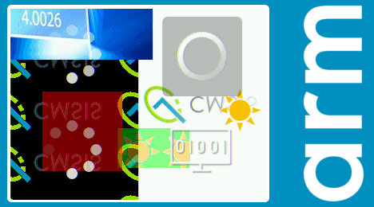
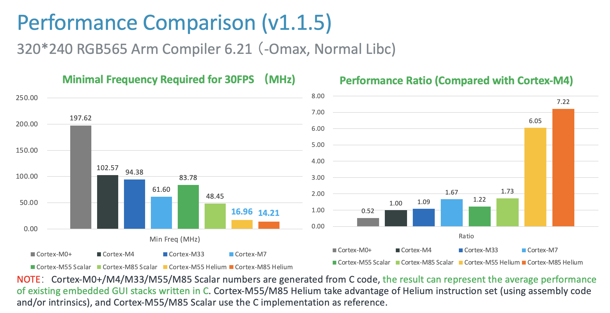
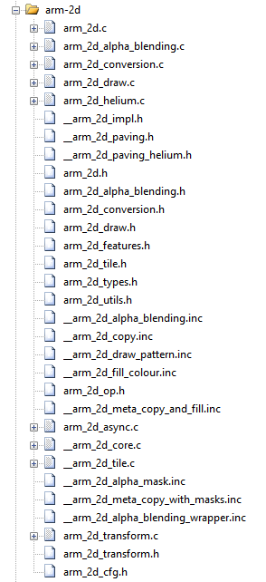

# README {#mainpage}

 


## Branch Summary


| Branch           | Description                                                  | Note                                      |
| ---------------- | ------------------------------------------------------------ | ----------------------------------------- |
| ***main***       | The main branch of the repository. It contains the Arm-2D library, examples, templates and a helper library. |                                           |
| ***developing*** | The development branch of the ***master/main*** branch.      | It will be merged into ***main*** branch. |

## Features

#### In this version ( ver1.1.0-preview)

The Arm-2D library provides **Low-Level 2D Image Processing Services** that are mainly used in **Deep Embedded Display system**. The supported features include but not limited to:

- **Support Accelerating LVGL** (**v8.3.0** or newer)
- **CMSIS-Pack is available.**
- **Alpha-Blending** / **Alpha-Masking**
  - With or without Colour-Keying
  - Filling-Colour with an Alpha-Mask
    - For drawing icons/texts with anti-alias in a specified colour
    - Supports an optional ***Opacity*** ratio can be applied.
- **Image Copy (Tiling)**
  - With or without Colour-Keying (a.k.a colour masking)
  - Supports four mirroring modes: No-mirroring, X-mirroring, Y-mirroring and XY-mirroring
  - Supports **alpha masks** on the source side and/or the target side 
- **Supported Colour formats**
  - **Gray8 (8-bit Grayscale)**, **RGB565** and **RGB888**
  - Generic **8bit colour**, **RGB16** and **RGB32**
  - Converting colour formats among **GRAY8**, **RGB565** and **RGB888** for any given tiles
- **Region/Window Clipping**
- **Generic Partial Frame-buffer (PFB)**
  - Transparent for upper layer software/GUI services
  - Easy to Use
  - No limitation on target screen resolution
  - No limitation on PFB size and shape (it could be a line or a rectangular with any size)
  - Supports the **Dirty Regions** when performing the low level refreshing
  - Supports swapping high and low bytes for RGB16 pixels
  - Introduce a **Scene Player** with various scene switching modes (Fade-In-Fade-Out, Slide, Erase etc.)
  - Support Various Buffer Modes with a built-in framebuffer pool. 
    - Single Buffer/Double-Buffers/Three-Buffers
    - Direct Mode
- **Transform** (i.e. rotation and scaling)
  - Supports Colour-keying by default
  - Supports an optional **Opacity** ratio
  - Supports the Anti-Alias feature. 
    - You can enable it by defining macro  `__ARM_2D_HAS_ANTI_ALIAS_TRANSFORM__` to `1` at **compile-time**.
  - Support source masks
- **An Unified and User-Friendly Programmers' Model**
  - APIs can be used in **Synchronous** manner (  **Classic and Blocking** ) and/or **Asynchronous** manner ( **Event-Driven** )
  - Supports both **bare-metal** and **RTOS** environment
  - Ultra small memory footprint
- **Support Virtual Resource**
  - Support loading resources from external memories which is not mapped to 4G memory space


### New Features Planned in the Future

- Image Filters, e.g. Generic Anti-aliasing algorithms
- Stretch and Perspective Transform
- A2, A4 Support
- DMAC-350 Support


## 1 Introduction

### 1.1 The Background

With more and more smart IoT edge devices introduced to our daily lives, people who are used to the smart-phone-like graphic user interfaces (GUIs) want to have the similar modernized user experience even when using microcontroller-based products. This trend has been long observed and understood by Arm's eco-partners. 

As a result, many silicon vendors introduce dedicated hardware accelerators into their microcontroller products to help 2D image processing. Meanwhile, GUI service providers also update their product lines to target microcontroller based GUI applications. Many open-source embedded GUI stacks are hot on GitHub, e.g. [LVGL](https://lvgl.io/). 

In fact, using GUI with microcontrollers isn't new at all. Still, until the recent rise of IoT and AI, people find that the simple and monotonous GUI is really unbearable. The pursuit of user experience similar to that of a smartphone has become a basic requirement for products. 

On the other hand, seemingly complicated GUIs are often implemented with simple 2D image-copy and -tiling. Even the translucent effect is not unaffordable for microcontrollers that often run under tens or hundreds of MHz. 

Technologies used for 2D graphics have been matured as early as the era of 8-bit Gaming Console. Since 8-bit 6502 can achieve fancy graphics effects, why can't the most advanced Cortex-M processor of the day?


### 1.2 The Problems in current solutions

As shown in **Figure 1-2**, Linux based systems have a complete ecosystem that provides GPU drivers and GUI software services. In contrast, resource-constrained embedded systems do not have such luxury. To enhance the MCU ecosystem, Arm-2D is introduced.

**Figure 1-2 Ecosystem Comparison between Rich Embedded and Constraint Embedded System in GUI**


When we look at the traditionally embedded  GUI architecture(as shown in **Figure 1-3** ), there are four layers: 1) the application and designer layer, 2) the GUI software service layer, 3) the rendering layer, and 3) the hardware driver layer. 

**Arm-2D focuses on accelerating the low-level 2D image processing**, and will not touch upper layers of the GUI software stacks, hence avoiding competing with GUI service providers in the same ecosystem. In fact, because Arm has proposed an abstraction layer for the low-level 2D image processing, **a whole ecological level of cooperation can be quickly established** between chip manufacturers that provide hardware accelerators and software providers that provide GUI services. **Everyone can concentrate on enlarging their own values**. For example, by adding arm-2d adaptor drivers for their proprietary 2D accelerators silicon vendors can achieve a wide range of support from GUI providers who build/port their GUI stack upon Arm-2D APIs.

**Figure 1-3 The Hierarchy of a Typical Embedded GUI System.**


### 1.3 The Platform

**The library is targeting ALL Cortex-M processors with/without various hardware 2D image accelerators:**

- Armv6-M processors: Cortex-M0/M0+/M1/SC000
- Armv7-M processors: Cortex-M3/M4/M7/SC300
- Armv8-M processors: Cortex-M23/M33/Star-MC1/M35P
- Armv8.1-M processors: Cortex-M55/M85

**The library is designed with ACI (Arm Custom Instructions) in mind.** Accelerations implemented with user-defined instructions can be integrated into the library easily without modifying the existing Arm-2D library or upper-layer software. 

**The library is designed with 2D image accelerators in mind and following the feature agnostic principle.**  The Support for accelerators can be added easily without modifying the existing Arm-2D library or upper-layer software. 

**The library is designed with resource constraints in mind.** **For Cortex-M processors with 4K~32K SRAM that cannot afford a full-frame-buffer**, Arm-2D introduces a feature called **Generic Partial Frame-buffer** enabling those existing MCUs to run GUI applications by practicing time-space exchange schemes while still enjoying a decent frame rate. 


### 1.4 Dependency

- The library depends on **CMSIS 5.7.0 and above** (If you want to use Arm-2D with Cortex-M55, CMSIS 5.8.0 is required). 
- The library is developed with the **C11** standard and depends on some **widely adopted GCC extensions**.
  - See **section 3.2** for details.
- The library supports **Arm Compiler 5**, **Arm Compiler 6**, **GCC**, **LLVM** and **IAR**
  - See **section 5** for details. 


### 1.5 Examples, Benchmark and Templates

#### 1.5.1 Summary

| Projects                           | Description                                                  | Folder                                      | Note                      |
| ---------------------------------- | ------------------------------------------------------------ | ------------------------------------------- | ------------------------- |
| benchmark                          | It is an **ALL-IN-ONE** example that demonstrates almost all features provided by Arm-2D. By setting different PFB sizes, you can evaluate the 2D image processing capability for the target system. | examples/benchmark                          | Can be used as benchmark. |
| watch_panel                        | It is a dedicated example of a smart-watch-like panel. A pointer and two gears rotate at different angular velocities on a translucent watch panel with a dynamic background. | examples/watch_panel                        | Can be used as benchmark  |
| \[template\]\[bare-metal\]\[pfb\]  | It is a project template for the bare-metal environment.     | examples/\[template\]\[bare-metal\]\[pfb\]  | Project Template          |
| \[template\]\[cmsis-rtos2\]\[pfb\] | It is a project template for the RTOS environment, which use CMSIS-RTO2 as an example to show how Arm-2D can work with an RTOS. | examples/\[template\]\[cmsis-rtos2\]\[pfb\] | Project Template          |


#### 1.5.2 Benchmark

There is no public 2D image processing benchmark available for microcontrollers. To facilitate the library development and optimization,  we overcome this problem with following methods:

- **Choose the widely used algorithms in embedded GUI as the body of the benchmark**
  - Alpha-blending
  - Colour-Keying
  - Blit
  - Tiling
  - Rotation
  - Mirroring
  - Masking
- **Simulate a typical application scenario with sufficient complexity**
  - Background with Texture paving (switching different mirroring modes every 4 second)
  - Foreground picture 
  - Two constructed layers for alpha-blending and texture paving
  - Moving icons
  - Spinning busy wheel
- **Choose a typical low-cost LCD resolution 320*240 in RGB565**
- **Let those layers float with different angles and speed to cover a sufficient number of conditions.**
- **Record the cycle count used for blending one frame and run 1000 iterations (frames).** 


**Figure 1-4 A snapshot of benchmark running on Cortex-M4 FVP platform**

  


- **Use the average cycle count in 1000 iterations as benchmark score.**

  - Based on that, for typical embedded application requirement, we derive a more meaningful metrics called the **Minimal Frequency Required for 30 FPS (MHz)** as shown in **Figure 1-5**. 

  

**Figure 1-5 Performance Comparison among some Cortex-M processors**

 


## 2 Folder Hierarchy

| Folder and File                  | Type    | Description                                                  |
| :------------------------------- | ------- | ------------------------------------------------------------ |
| **Library**                      | Folder  | This folder contains the source files and header files of the library. |
| **Helper**                       | Folder  | This folder contains the source files and header files of helper functions / services. |
| documentation                    | Folder  | This folder contains all the documents.                      |
| examples                         | Folder  | This folder contains all the example code / projects.        |
| README                           | .md     | The README.md you are currently reading.                     |
| how_to_deploy_the_arm_2d_library | .md     | A step by step guidance helping you to deploy the Arm-2D library to your projects. |
| LICENSE                          | License | The Apache 2.0 License                                       |
| tools                            | Folder  | This folder contains some useful utilities for using the library. For example, img2c.py is a python script that convert a specified picture into the tile data structure. |


## 3 Tips For Exploring the Library

### 3.1 "I am a library user, I only care about how to use the library"

- For library users, **ALL** useful information, i.e. type definitions, macros, prototypes of functions etc., are stored in header files which have **NO** double under-scope as their prefixes. We call those header files the **PUBLIC HEADER FILES**. 
- Please **ONLY** use APIs, macros and types that are defined in the public header files. 

**Figure 3-1 Private and Public Files** 

 

- Any symbol, e.g. file name, function name, macro name, type name etc., having a double under-scope as the prefix is considered as **PRIVATE** to the library. You should save your time from touching them. 

- The library is designed with the philosophy that Users are free to use anything in public header files and should not touch anything marked implicitly or explicitly as private. 

- Despite which processor you use, during the compilation, all C source files are safe to be added to the compilation (and we highly recommend you to do this for simplicity reason). For example, when you use Cortex-M4, which doesn't support Helium extension (introduced by Armv8.1-M architecture and first implemented by the Cortex-M55 processor), it is OK to include `arm_2d_helium.c` in the compilation process, as the C source files are constructed with environment detection in pre-processing phase. 

- In your application, including `arm_2d.h` is sufficient to get all the services and APIs ready for you. 

- Make sure that the library is initialised by calling `arm_2d_init()` before using any of the services. 

  **NOTE**: 

  1. Feature configuration macros are checked by `arm_2d_feature.h`. For the current stage of the library, please **DO NOT** override those feature configuration macros.
  
  

### 3.2 "I am interested in the implementation"

- We apologise that at the current stage (it's the early stage, as you can see), there is no sufficient guidance or documents about:
  - How the library is implemented
  - How to contribute
  - How to add new features
  - What's the design principles behind the code
  - What's the structure of the design in details
- Some design considerations:
  - The library supports **Arm Compiler 5/6**, **GCC**, **LLVM** and **IAR**.
  - The library supports **ALL** Cortex-M processors. There should be no problem for working with existing Cortex-M processors, i.e. **Cortex-M0/M0+/M1/M3/M4/M7/M23/M33/Star-MC1/M35P/M55/M85**. If you find any issue, please feel free to let us know. 
  - The library is designed with some **OOPC** (Object-Oriented Programming with ANSI-C) methodologies. And the bottom line is that any methods and tricks adopted in this library should come with no or very little cost. 
- This library is compliant with **C11** standard and uses some **widely accepted GCC extensions**:
  - [Macros with a Variable Number of Arguments](https://gcc.gnu.org/onlinedocs/gcc/Variadic-Macros.html#Variadic-Macros) 
  - [ ***\_\_alignof\_\_()*** ](https://gcc.gnu.org/onlinedocs/gcc/Alignment.html#Alignment) 
  - [Unnamed Structure and Union Fields](https://gcc.gnu.org/onlinedocs/gcc/Unnamed-Fields.html)
  - [Statements and Declarations in Expressions](https://gcc.gnu.org/onlinedocs/gcc/Statement-Exprs.html#Statement-Exprs)
- Some of the definitions are written with the support of the **Microsoft Extensions** in mind \( `-fms-extensions` \), but **the library never depends on it**. This means that if programmers enable the support of the Microsoft Extensions in their project, they can benefit from it. 
- This library follows ***"Using Extensions to replace Modifications"*** principle
  - Keywords `__WEAK` and `__OVERRIDE_WEAK` are introduced for default functions and extensions; it is similar to the concept of "virtual functions" and "override functions" in C#. 
    - `arm_2d_async.c` is used to override some infrastructure functions in `arm_2d.c` to support asynchronous mode in the programmers' mode.  
    - ***arm_2d_helium.c*** is used to override some default software algorithm implementations across the library. 
  - Supports for hardware accelerators (both from Arm and 3rd-parties) should be added in the same manner in the future. 
    
    - Override the target low level IO defined with `def_low_lv_io()` macro that originally defined in `arm_2d_op_table.c` to add your own version of algorithms and hardware accelerations. For example, if you want to add alpha-blending support for RGB565 using your 2D hardware accelerator, you should do the following steps:
    
      1. In one of your own C source code, override the definition of `__ARM_2D_IO_ALPHA_BLENDING_RGB565`
    
         ```c
         //! PLEASE add following three lines in your hardware adapter source code
         #define __ARM_2D_IMPL__
         #include "arm_2d.h"
         #include "__arm_2d_impl.h"
         
         ...
         
         __OVERRIDE_WEAK
         def_low_lv_io(__ARM_2D_IO_ALPHA_BLENDING_RGB565, 
                         __arm_2d_rgb565_sw_alpha_blending,
                         __arm_2d_rgb565_my_hw_alpha_blending);
         ```
    
      2. Copy the function body of `__arm_2d_rgb565_sw_alpha_blending()` to your source code as a template of the ***hardware adaptor*** and rename it as `__arm_2d_rgb565_my_hw_alpha_blending()`
    
      3. Modify ***\_\_arm_2d_rgb565_my_hw_alpha_blending()*** to use your own hardware accelerator. 
    
      4. Based on the arguments passed to the function and the capability of your 2D accelerator, you can:
    
         - return `ARM_2D_ERR_NOT_SUPPORT` if the hardware isn't capable to do what is requested.
         - return `arm_fsm_rt_cpl` if the task is done immediately and no need to wait.
         - return `arm_fsm_rt_async` if the task is done asynchronously and later report to arm-2d by calling function `__arm_2d_notify_sub_task_cpl()`. 
    
      ***NOTE***: The Arm-2D pipeline will keep issuing tasks to your ***hardware adaptor***, please quickly check whether the hardware is capable of doing the work or not, and then add the task (an `__arm_2d_sub_task_t` object) to a list in ***First-In-First-Out*** manner if your hardware adaptor decides to keep it. After that, your hardware accelerator can fetch tasks one by one.  

``````c
typedef struct __arm_2d_sub_task_t __arm_2d_sub_task_t;


typedef arm_fsm_rt_t __arm_2d_io_func_t(__arm_2d_sub_task_t *ptTask);

typedef struct __arm_2d_low_level_io_t {
    __arm_2d_io_func_t *SW;
    __arm_2d_io_func_t *HW;
} __arm_2d_low_level_io_t;

...

/*----------------------------------------------------------------------------*
 * Low Level IO Interfaces                                                    *
 *----------------------------------------------------------------------------*/
__WEAK
def_low_lv_io(__ARM_2D_IO_COPY_RGB16, __arm_2d_rgb16_sw_tile_copy);
__WEAK
def_low_lv_io(__ARM_2D_IO_COPY_RGB32, __arm_2d_rgb32_sw_tile_copy);

__WEAK
def_low_lv_io(__ARM_2D_IO_FILL_RGB16, __arm_2d_rgb16_sw_tile_fill);
__WEAK
def_low_lv_io(__ARM_2D_IO_FILL_RGB32, __arm_2d_rgb32_sw_tile_fill);

...
``````


## 4 Documentation

| Name                                                         | Description                                                  | Location  |
| ------------------------------------------------------------ | ------------------------------------------------------------ | --------- |
| **README.md**                                                | It is the document that you are reading. It provides basic information and guidance for the arm-2d library. | (root)    |
| **[how_to_deploy_the_arm_2d_library.md](./documentation/how_to_deploy_the_arm_2d_library.md)** | A step by step guide that helps you to deploy the library to your existing or new projects. | documentation    |
| **[introduction.md](./documentation/introduction.md)**       | A relatively detailed introduction for the library, including basic concepts, programmers' mode etc. | documentation |
| **[how_to_use_tile_operations.md](./documentation/how_to_use_tile_operations.md)** | A detailed document elaborates the APIs dedicated to basic tile operations in the arm-2d library. | documentation |
| **how_to_use_alpha_blending_operations.md**                  | A detailed document elaborates the APIs dedicated to alpha-blending services provided by the arm-2d library. | documentation |
| **how_to_use_conversion_operations.md**                      | A detailed document elaborates the APIs dedicated to colour space conversion services provided by the arm-2d library. | documentation |
| **how_to_use_drawing_operations.md**                         | A detailed document elaborates the APIs that provide basic point-drawing and colour-filling services in the arm-2d library. | documentation |


## 5 Limitations

### 5.1 The Generic Limitations

- The library focus on Cortex-M processors in principle.
- The library should be compiled with the following compilers:
  - Arm Compiler 5 (**Deprecated**)
  - Arm Compiler 6
  - GCC
  - LLVM
  - IAR
- The library focus on **Low Level Pixel Processing Acceleration**
  - In principle, the library will **NOT** provide APIs for content creation, such as drawing shapes, text display etc., but simple point drawing and colour-filling APIs .
  - In principle, the library will **NOT** provide data structures or related algorithms essential for creating a GUI, for example, element tree, GUI message handling and the tree traversal algorithms.


### 5.2 The Temporary Limitations

- The GCC support for Cortex-M55 (helium acceleration) is broken (waiting for tool-chain update). 
- Generic Anti-aliasing algorithms haven't been introduced, but anti-alias in transform (i.e. rotation and scaling) is supported.
- The library currently only provides default software algorithms and a **[Helium](https://developer.arm.com/architectures/instruction-sets/simd-isas/helium) based acceleration library**. 
  - Although planned, no accelerator support is implemented for now.
  - Although planned and implemented, the [ACI (Arm Custom Instruction)](https://developer.arm.com/architectures/instruction-sets/custom-instructions) acceleration solutions are not open-source for now. Please contact local Arm FAE for details. 
- The provided example projects only run on [MPS2](https://developer.arm.com/tools-and-software/development-boards/fpga-prototyping-boards/mps2), [MPS3](https://developer.arm.com/tools-and-software/development-boards/fpga-prototyping-boards/mps3), [FVP](https://developer.arm.com/tools-and-software/open-source-software/arm-platforms-software/cortex-m-platforms-software) and some 3rd party development platforms, e.g. **STM32F746G-Discovery** and **Raspberry Pi Pico**. 
  - Feel free to try the library on your own devices. The library depends on No specific peripheral. 
- Example projects are based on MDK (one of the most popular development environments for Cortex-M processors ).


## 6 Feedback

As mentioned at the beginning, the purpose of this project is to explore and demonstrate the possibilities of delivering smart-phone-like modern GUI using low-cost and resource constraint micro-controllers. We expect that arm-2d could inspire more similar initiatives and engineering practices. Hence, your feedback and thoughts are precious to us. 

If you can to spend some time and try the library, please feel free to leave your thoughts. It would be nice to contains following information:

- The target application and/or industry segment which you want to introduce a GUI using Cortex-M processors
- The resources of your platform, such as the size of the RAM, ROM, system frequency, the average power consumption etc.
- The LCD resolution and target frame-rate (FPS)
- Algorithms that you find most useful but missing
- About the device
  - Does it contain HW accelerators for 2D image processing? 
  - What is the feature set of this 2D accelerator?
  - Does it contain features that are currently missing in this library?
- Any other thoughts or suggestions.


Thank you for your time.

***Arm-2D Development Team.***

11 Aug 2022
