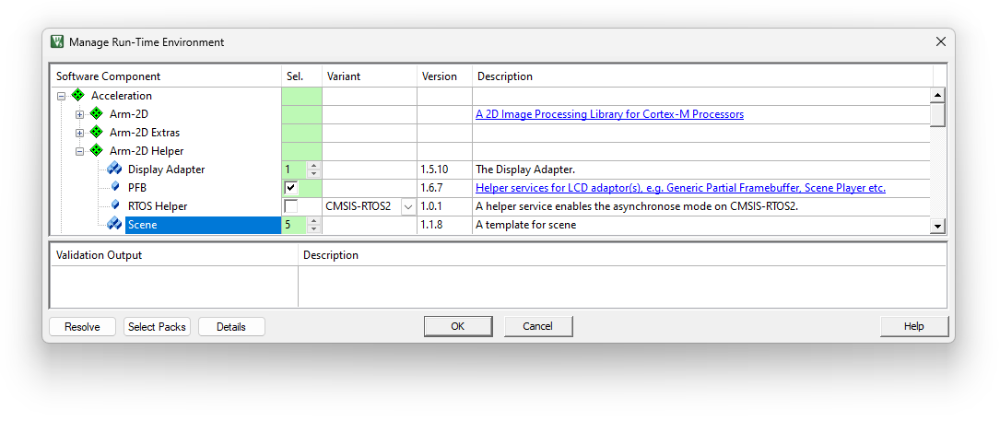
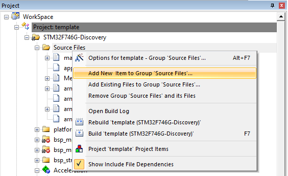
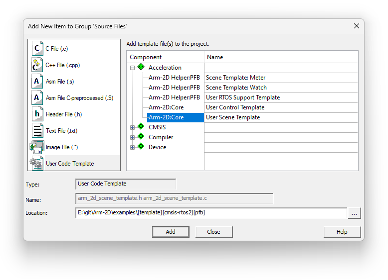

# Getting Started as an Application Designer <!-- omit from toc -->

## 1 Before We Start

**Arm-2D is not a GUI.** To be called GUI, it lacks many critical components, such as the element tree, the message processing, a rich set of controls, the support for interactive input devices, and a nice-to-have GUI designer.

If possible, I hope that no one would have to use Arm-2D directly to create GUI applications. However, under the cost pressure, some embedded products must develop GUI applications in resource-constrained environments (e.g. 64K Flash, 12K RAM etc.). Meanwhile, even some devices have relatively richer resources, the application software is often too big to reserve sufficient memory for using a decent GUI stack. Supporting GUI applications in resource constraint environments is a world forgotten by the mainstream embedded GUI stacks.

If the graphics in your application is simple, i.e. consists of panels (for displaying parameters and user settings), and the human-machine interactions are implemented based on a keyboard (or a touch panel without complex touch gestures), then using Arm-2D APIs directly to design GUI applications might be an option.  In fact, if you can figure out a way to fulfill the missing parts aforementioned, the GUI application designed with Arm-2D is not only looking good but also has an impressively low memory footprint. 

If you happen to meet the conditions above, **don't panic**, we will try our best to provide you with a easy-and-efficient development experience. **By focusing on the API usage and following the guidance** introduced in this article, **you can master the Arm-2D application design quickly**.


### Table of Content <!-- omit from toc -->

- [1 Before We Start](#1-before-we-start)
- [2 Step by Step Guidance](#2-step-by-step-guidance)
  - [2.1 Familiar with the basic concepts](#21-familiar-with-the-basic-concepts)
  - [2.2 Port Arm-2D to your local platform](#22-port-arm-2d-to-your-local-platform)
  - [2.3 Try the basic Tile Operations and the Layout Assistant](#23-try-the-basic-tile-operations-and-the-layout-assistant)
  - [2.4 Try existing example controls](#24-try-existing-example-controls)
  - [2.5 Write a simple GUI Application](#25-write-a-simple-gui-application)
  - [2.6 Learn the basic method to optimize the performance and memory footprint](#26-learn-the-basic-method-to-optimize-the-performance-and-memory-footprint)
  - [2.7 Tips for other advanced topics](#27-tips-for-other-advanced-topics)
    - [2.7.1 Benchmarks](#271-benchmarks)
    - [2.7.2 Asynchronose Mode and RTOS support](#272-asynchronose-mode-and-rtos-support)
- [3 Tips For Exploring the Library](#3-tips-for-exploring-the-library)
  - ["I am a library user, I only care about how to use the library"](#i-am-a-library-user-i-only-care-about-how-to-use-the-library)


## 2 Step by Step Guidance

### 2.1 The basic concepts

The first step of getting started is learning some basic concepts, among which ***Tile***, ***Region*** and ***Bounding Box model*** are the most fundamental ones, because almost all of the APIs take Tile(s) and Region(s) as input/output. Please kindly reading [**README**](../README.md) and [**Introduction**](./introduction.md) for details. 


### 2.2 Port Arm-2D to your local platform

After learning the basic concepts of Arm-2d, please follow the guidance, [how_to_deploy_the_arm_2d_library.md](./how_to_deploy_the_arm_2d_library.md), to deploy Arm-2d onto your local hardware platform. 

Of course, if you want to skip the porting step and jump to learn how to use the Arm-2D APIs, please try the template projects we prepared for you in the `examples` directory. These template projects provide porting for STM32 Discovery Board, Cortex-M FVP/VHT and MPS2/MPS3 development platforms in both bare-metal and RTOS environments respectively. In addition, there are other 3rd-party porting available on Github, for example:

- [A porting for Raspberry Pi Pico (using MDK)](https://github.com/GorgonMeducer/Pico_Template)
- [A porting for LVGL + Arm-2D on Corstone-300-FVP](https://github.com/lvgl/lv_port_an547_cm55_sim)


### 2.3 Try the basic Tile Operations and the Layout Assistant

After having a working platform, it is good to try Arm-2D APIs with the help of [how_to_use_tile_operations.md](./how_to_use_tile_operations.md). During this process, reading [how_to_use_layout_assistant.md](./how_to_use_layout_assistant.md) to learn the basic layout method can make your application development much easier.

At this stage, one might have an outstanding question: where should I use these APIs to practice drawing operations? Please open `arm_2d_disp_adapter_0.c` and find the function `__pfb_draw_handler` as shown below - This is our playground.

```c
static
IMPL_PFB_ON_DRAW(__pfb_draw_handler)
{
    ARM_2D_UNUSED(pTarget);
    ARM_2D_UNUSED(ptTile);

    arm_2d_canvas(ptTile, __top_container) {
    
        arm_2d_fill_colour(ptTile, NULL, GLCD_COLOR_WHITE);
        
        arm_2d_align_centre(__top_container, 100, 100) {
            draw_round_corner_box(  ptTile,
                                    &__centre_region,
                                    GLCD_COLOR_BLACK,
                                    64,
                                    bIsNewFrame);
        }

        busy_wheel2_show(ptTile, bIsNewFrame);
    }

    arm_2d_op_wait_async(NULL);

    return arm_fsm_rt_cpl;
}
```

As you can see, this example code has:

- Filled the background with the white colour
- Drawn a rounded corner box in black with a given opacity ratio in the centre of the screen
- Drawn a busy-wheel with an existing control. 


**Figure 2-1 The Default Scene of an Display Adapter.**

 


You can replace the code inside `__pfb_draw_handler` with your own and visually check the result in the default scene hidden by the display adapter. During this process, you can, of course, use the default picture resources coming with Arm-2d, for example, the CMSIS-Logo as shown in **Figure 2-2** via corresponding `arm_2d_tile_t` objects: `c_tileCMSISLogoGRAY8`, `c_tileCMSISLogoRGB565` and `c_tileCMSISLogoCCCA8888` defined in `cmsis_logo.c`. But sooner or later, you would like to use your own pictures. Arm-2D provides a Python script to help you convert images into `arm_2d_tile_t` objects in C. For more details, please read this [guide](../tools/README.md). 

**Figure 2-2 The Default Picture resource: CMSIS logo**

 


When you complete the above steps, **congratulations, you have successfully started Arm-2d.**


### 2.4 Try existing example controls

Arm-2D provides some controls in the `examples/common` directory, which are good reference codes and can be used in the project directly. Generally speaking, when you add the component `Acceleration::Arm-2D Extras::Controls` in the RTE configuration (as shown in **Figure 2-3**), all control source codes and related resources will be added to the project. 

**NOTE:** those unused controls or resources will be removed from the generated firmware image.

**Figure 2-3 Selecting Controls in RTE**

 


### 2.5 Write a simple GUI Application

For an actual application, you cannot write everything in the default scene hidden in the display adapter. You might already know that the display adapter provides a service called Scene Player, which maintains a FIFO of scenes, allowing us to add new scenes and requests scene switching, during which the Scene Player could optionally apply some visual effects like fade-in-fade-out, erasing, sliding etc.

**An application is designed and organized as a series of scenes.** When and How to switch to Which scenes are totally under your control. When using RTE to deploy Arm-2D, there are two simple ways to add a new scene:

- Using RTE configuration to add new scenes

    In RTE configuration, you can change the number of `Acceleration::Arm-2D Helper::Scene` to add new scenes to your project, as shown below:

    **Figure 2-4 Adding new scenes in RTE**

     

    All scenes added with this method are included in the header file `arm_2d_scenes.h`, which you can included in your c source code:
    ```c
    #include "arm_2d_helper.h"          /* arm_2d.h is also included in this header file */
    #include "arm_2d_disp_adapters.h"   /* include all display adapters */
    #include "arm_2d_scenes.h"          /* include all scenes added in RTE */
    ```

    By calling the constructor `arm_2d_sceneN_init()`, the target scene is created, initialised and added to the Scene Player FIFO. For example:

    ```c
    int main(void)
    {
        ...
        arm_2d_init();
        disp_adapter0_init();
    
        /* create scene0 and add to the Display Adapter FIFO */
        arm_2d_scene0_init(&DISP0_ADAPTER);
    
        /* Switch to the next scene, i.e. scene0 in this case  */
        arm_2d_scene_player_switch_to_next_scene(&DISP0_ADAPTER);
    
        while(1) {
            disp_adapter0_task();
            ...
        }
    }
    ```

    **NOTE**: if we haven't disabled the default scene in the `Display Adapter 0`, then after adding the scene0 to the FIFO by calling the `arm_2d_scene0_init`(), it is the next available scene in the FIFO, and you have to call `arm_2d_scene_player_switch_to_next_scene()` to show it on the screen. If we have disabled the default scene, then after calling the constructor, scene0 is the 1st available scene in the FIFO and is shown as the current scene on the screen. In this case, you don't have to call `arm_2d_scene_player_switch_to_next_scene()`. 


- Using Code Template to add new scenes

    Except for the method above, you can add a new scene through the code template. For any given group in the project view, you can right-click and select "**Add New Item to Group**" in the pop-up menu (as shown in **Figure 2-5**), then in the dialog find "**User Code Template**", expand the Acceleration and select the `Arm-2D:Core::User Scene Template` (as shown in **Figure 2-6**). 

    **Figure 2-5 Adding New Items to a Group**
    
     

    
    **Figure 2-6 Adding a New Scene using Code Template**
    
     
    
    After clicking the "Add" button, two files `arm_2d_scene_template.h` and `arm_2d_scene_template.c` will be added to your project folder. Open those two files and replace all `<NAME>` with your scene name, for example, `MY_SCENE` in upper case and replace all `<scenen>` with the same name in the lower case, for example, `my_scene`.
    
    **NOTE**: scenes added with code template are not included in the `arm_2d_scenes.h` and you have to include the header file mannually. 

    By default, the display adapter switches scenes without any visual effects or delays when it is proper to do so after receiving a switching request. You can set some predefined switching visual effects by calling the function `arm_2d_scene_player_set_switching_mode()`. For example:

    ```c
    /* set switching visual effects: Fade-in-Fade-out in White */
    arm_2d_scene_player_set_switching_mode( &DISP0_ADAPTER,
                                            ARM_2D_SCENE_SWITCH_MODE_FADE_WHITE);
    
    /* the period of the switching effect */
    arm_2d_scene_player_set_switching_period(&DISP0_ADAPTER, 3000);
    
    arm_2d_scene_player_switch_to_next_scene(&DISP0_ADAPTER);
    ```

    In some visual effects, you can specify the period of the switching process by calling the function `arm_2d_scene_player_set_switching_period()`. For more, please check the header file `arm_2d_helper_scene.h`. 


### 2.6 Learn the basic method to optimize the performance and memory footprint

The design consideration of optimizing performance and memory footprint deserves a dedicated document or maybe more. We can only cover some preliminary tips for optimisation:

- **For the Arm Compiler 6**

  - Avoid using Arm Compiler 5 whenever possible. 
  - If the ROM is sufficient, try to use **-Omax + Link Time Optimisation**
  - If the both the performance and the code memory footprint are important, try to use **-Os + Link Time Optimisation**
  - If the code memory footprint is vital, try to use **-Oz + Link Time Optimisation**
  - Do **NOT** use **-O0** unless you are debugging. 

- **For RAM memory footprint**

  - Set the FPB size **starting from the 1/10 full framebuffer**.
  - For the same number of pixels, **prioritize the width over the height** when setting the PFB. For example, 320 * 8 is better than 80 * 32.
  - Whenever possible, **the PFB height should be larger than or equal to 8.** 

- **For performance (Frame-rate)**

  - LCD Latency determines the upper-limit of the system frame-rate. Reduce it towards zero with all the methods available. 
  - **Use Asynchornouse mode** (e.g. DMA+ISR) when it is possible.
  - Using 1/10 framebuffer doesn't mean it is 10x slower than using a full framebuffer

- **For API Usage**

  - Please use the feature-specific version rather than the more generic version whenever possible for a given operation. This helps to reduce the memory footprint in general.

    For example: for copying an rgb565 tile with a source mask and no-mirroring, please use the function `arm_2d_rgb565_tile_copy_with_src_mask_only()` instead of `arm_2d_rgb565_tile_copy_with_masks()`. 


### 2.7 Tips for other advanced topics

#### 2.7.1 Benchmarks

To evaluate the 2D performance for the target platform, Arm-2D provides two benchmarks, i.e. **Benchmark-Generic** and **Benchmark-Watchpanel**. You can deploy one of them by selecting the it in the RTE configuration as shown in **Figure 2-7**.

**Figure 2-7 Selecting Benchmarks in RTE**

 

The original benchmark cannot fit into the memory if your MCU has a small Flash. To solve this problem, Arm-2D introduces a Tiny mode for both benchmarks. You can enable it by either setting the macro `__ARM_2D_CFG_BENCHMARK_TINY_MODE__` to `1` in `arm_2d_cfg.h` or defining the macro in your project configuration. 

**NOTE:** You can find ALL benchmark related configurations in `arm_2d_cfg.h`. 

Running benchmark is simple:

1. Include  `arm_2d_benchmark.h` 
2. call function `arm_2d_run_benchmark()` after initializing Arm-2D

```c
#include "arm_2d_helper.h"
#include "arm_2d_benchmark.h"


int main (void)
{
    ...
    arm_irq_safe {
        arm_2d_init();
    }

    arm_2d_run_benchmark();
    
    while(1) {
        __NOP();
    }
}
```


#### 2.7.2 Asynchronose Mode and RTOS support

Arm-2D introduces an asynchronous mode for hardware accelerators and multi-core systems. To enable this feature, you can set the macro `__ARM_2D_HAS_ASYNC__` defined in `arm_2d_cfg.h` to `1`. If you don't have hardware accelerators, 2D capable DMA (for example, DMAC-350) or dedicated Cortex-M core(s) for 2D graphics, enabling the Asynchronous mode brings no benefits. 

When it is good to enable the asynchronous mode, you have to have RTOS support to take advantage of it. You can enable the RTOS support in RTE as shown in **Figure 2-8**. If you cannot find the desired RTOS in the drop list, please select the User Custom and implement the interfaces listed in the source code `arm_2d_helper_rtos_user.c`.

**Figure 2-8 Enable RTOS Support in RTE**

 

You do **NOT** have to enable the RTOS support in the synchronous mode (`__ARM_2D_HAS_ASYNC__` is `0` ). Even so, you can still use a dedicated thread to run the Arm-2D display adapter task (e.g. `disp_adapter0_task()`) and lock the framerate to a desired value. For example:

```c
#ifndef LCD_TARGET_FPS
#   define LCD_TARGET_FPS       30
#endif

__NO_RETURN
void app_2d_main_thread (void *argument) 
{

    while(1) {
        //! retrieve the number of system ticks
        uint32_t wTick = osKernelGetTickCount();        
        while(arm_fsm_rt_cpl != disp_adapter0_task());
        
        //! lock frame rate
        osDelayUntil(wTick + (1000 / LCD_TARGET_FPS));
    }

    //osThreadExit();
}
```


## 3 Tips For Exploring the Library

### "I am a library user, I only care about how to use the library"

- For library users, **ALL** useful information, i.e. type definitions, macros, prototypes of functions etc., are stored in header files which have **NO** double under-scope as their prefixes. We call those header files the **PUBLIC HEADER FILES**. 
- Please **ONLY** use APIs, macros and types that are defined in the public header files. 

- Any symbol, e.g. file name, function name, macro name, type name etc., having a double under-scope as the prefix is considered as **PRIVATE** to the library. You should save your time from touching them. 

- The library is designed with the philosophy that Users are free to use anything in public header files and should not touch anything marked implicitly or explicitly as private. 

- Despite which processor you use, during the compilation, all C source files are safe to be added to the compilation (and we highly recommend you to do this for simplicity reason). For example, when you use Cortex-M4, which doesn't support Helium extension (introduced by Armv8.1-M architecture and first implemented by the Cortex-M55 processor), it is OK to include `arm_2d_helium.c` in the compilation process, as the C source files are constructed with environment detection in pre-processing phase. 

- In your application, including `arm_2d.h` is sufficient to get all the services and APIs ready for you. 

- Make sure that the library is initialised by calling `arm_2d_init()` before using any of the services. 

  **NOTE**: 

  1. Feature configuration macros are checked by `arm_2d_feature.h`. For the current stage of the library, please **DO NOT** override those feature configuration macros.
