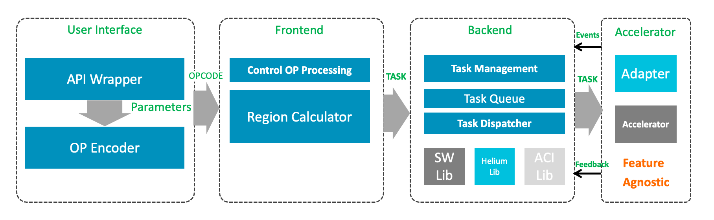

# How To Accelerate Arm-2D


Arm-2D provides several standard ways to add support for the hardware acceleration of your target platform. Those methods address the typical 2D accelerations that are available in the ecosystem. Arm-2D categorizes them into several topics:

- Accelerations that are **Tightly Coupled with Software Algorithm**. This is also known as **Synchronouse** Acceleration.
- Accelerations **Asynchronousely** via dedicated Processing Element (PE).
  - 2D-Capable-DMA, for example: DMAC-350, DMA2D
  - 2D GPUs
  - Processors are dedicated for running 2D processing tasks
- Acceleration via **Arm Custom Instruction (ACI)**


Depending on the capability of the target platform, the acceleration methods might exist simultaneously, for example, a dual-core Cortex-M55 system with Helium and ACI extensions, using DMAC-350 to accelerate some 2D operations. In other words, the aforementioned acceleration methods are not mutually exclusive. You can apply and enable them to arm-2d if available.

>  **NOTE**: 
>
> 1. When Helium is available, and one enables the Helium support during the compilation, Arm-2D detects the Helium and turns on the Helium acceleration automatically. 
> 2. This document is for system/application engineers who design drivers to add various accelerations to Arm-2D for a target hardware platform. 


## 1 Software Tightly Coupled (Synchronouse) Acceleration 

### 1.1 Acceleration via Arm-2D Intrinsics

Arm-2D uses some Arm-2D specific Intrinsics in the default low-level C implementations. These intrinsics are defined as macros in  the private header file `__arm_2d_impl.h`:

```c

#ifndef __ARM_2D_PIXEL_BLENDING_INIT
#   define __ARM_2D_PIXEL_BLENDING_INIT
#endif

#ifndef __ARM_2D_PIXEL_BLENDING_GRAY8
#   define __ARM_2D_PIXEL_BLENDING_GRAY8(__SRC_ADDR, __DES_ADDR, __TRANS)       \
            do {                                                                \
                uint16_t hwOPA = 256 - (__TRANS);                               \
                const uint8_t *pchSrc = (uint8_t *)(__SRC_ADDR);                \
                uint8_t *pchDes = (uint8_t *)(__DES_ADDR);                      \
                                                                                \
                *pchDes = ((uint16_t)( ((uint16_t)(*pchSrc++) * hwOPA)          \
                                     + ((uint16_t)(*pchDes) * (__TRANS))        \
                                     ) >> 8);                                   \
            } while(0)
#endif

#ifndef __ARM_2D_PIXEL_BLENDING_RGB565
#   define __ARM_2D_PIXEL_BLENDING_RGB565(__SRC_ADDR, __DES_ADDR, __TRANS)      \
            do {                                                                \
                uint16_t hwOPA = 256 - (__TRANS);                               \
                __arm_2d_color_fast_rgb_t tSrcPix, tTargetPix;                  \
                uint16_t *phwTargetPixel = (__DES_ADDR);                        \
                __arm_2d_rgb565_unpack(*(__SRC_ADDR), &tSrcPix);                \
                __arm_2d_rgb565_unpack(*phwTargetPixel, &tTargetPix);           \
                                                                                \
                for (int i = 0; i < 3; i++) {                                   \
                    uint16_t        hwTemp =                                    \
                        (uint16_t) (tSrcPix.BGRA[i] * hwOPA) +                  \
                        (tTargetPix.BGRA[i] * (__TRANS));                       \
                    tTargetPix.BGRA[i] = (uint16_t) (hwTemp >> 8);              \
                }                                                               \
                                                                                \
                /* pack merged stream */                                        \
                *phwTargetPixel = __arm_2d_rgb565_pack(&tTargetPix);            \
            } while(0)
#endif

#ifndef __ARM_2D_PIXEL_BLENDING_CCCN888
#   define __ARM_2D_PIXEL_BLENDING_CCCN888(__SRC_ADDR, __DES_ADDR, __TRANS)     \
            do {                                                                \
                uint16_t hwOPA = 256 - (__TRANS);                               \
                /* do not change alpha */                                       \
                uint_fast8_t ARM_2D_SAFE_NAME(n) = sizeof(uint32_t) - 1;        \
                const uint8_t *pchSrc = (uint8_t *)(__SRC_ADDR);                \
                uint8_t *pchDes = (uint8_t *)(__DES_ADDR);                      \
                                                                                \
                do {                                                            \
                    *pchDes = ( ((uint_fast16_t)(*pchSrc++) * hwOPA)            \
                              + ((uint_fast16_t)(*pchDes) * (__TRANS))          \
                              ) >> 8;                                           \
                     pchDes++;                                                  \
                } while(--ARM_2D_SAFE_NAME(n));                                 \
            } while(0)
#endif
            
#ifndef __ARM_2D_PIXEL_BLENDING_OPA_GRAY8
#   define __ARM_2D_PIXEL_BLENDING_OPA_GRAY8(__SRC_ADDR, __DES_ADDR, __OPA)     \
            do {                                                                \
                uint16_t hwTrans = 256 - (__OPA);                               \
                const uint8_t *pchSrc = (uint8_t *)(__SRC_ADDR);                \
                uint8_t *pchDes = (uint8_t *)(__DES_ADDR);                      \
                                                                                \
                *pchDes = ((uint16_t)( ((uint16_t)(*pchSrc++) * (__OPA))        \
                                     + ((uint16_t)(*pchDes) * hwTrans)          \
                                     ) >> 8);                                   \
            } while(0)
#endif

#ifndef __ARM_2D_PIXEL_BLENDING_OPA_RGB565
#   define __ARM_2D_PIXEL_BLENDING_OPA_RGB565(__SRC_ADDR, __DES_ADDR, __OPA)    \
            do {                                                                \
                uint16_t hwTrans = 256 - (__OPA);                               \
                __arm_2d_color_fast_rgb_t tSrcPix, tTargetPix;                  \
                uint16_t *phwTargetPixel = (__DES_ADDR);                        \
                __arm_2d_rgb565_unpack(*(__SRC_ADDR), &tSrcPix);                \
                __arm_2d_rgb565_unpack(*phwTargetPixel, &tTargetPix);           \
                                                                                \
                for (int i = 0; i < 3; i++) {                                   \
                    uint16_t        hwTemp =                                    \
                        (uint16_t) (tSrcPix.BGRA[i] * (__OPA)) +                \
                        (tTargetPix.BGRA[i] * hwTrans);                         \
                    tTargetPix.BGRA[i] = (uint16_t) (hwTemp >> 8);              \
                }                                                               \
                                                                                \
                /* pack merged stream */                                        \
                *phwTargetPixel = __arm_2d_rgb565_pack(&tTargetPix);            \
            } while(0)
#endif

#ifndef __ARM_2D_PIXEL_BLENDING_OPA_CCCN888
#   define __ARM_2D_PIXEL_BLENDING_OPA_CCCN888(__SRC_ADDR, __DES_ADDR, __OPA)   \
            do {                                                                \
                uint16_t hwTrans = 256 - (__OPA);                               \
                /* do not change alpha */                                       \
                uint_fast8_t ARM_2D_SAFE_NAME(n) = sizeof(uint32_t) - 1;        \
                const uint8_t *pchSrc = (uint8_t *)(__SRC_ADDR);                \
                uint8_t *pchDes = (uint8_t *)(__DES_ADDR);                      \
                                                                                \
                do {                                                            \
                    *pchDes = ( ((uint_fast16_t)(*pchSrc++) * (__OPA))          \
                              + ((uint_fast16_t)(*pchDes) * hwTrans)            \
                              ) >> 8;                                           \
                     pchDes++;                                                  \
                } while(--ARM_2D_SAFE_NAME(n));                                 \
            } while(0)
#endif

#ifndef __ARM_2D_PIXEL_AVERAGE_RGB565
#   define __ARM_2D_PIXEL_AVERAGE_RGB565(__PIXEL_IN, __ALPHA)                   \
    do {                                                                        \
        __arm_2d_color_fast_rgb_t tTempColour;                                  \
        __arm_2d_rgb565_unpack((__PIXEL_IN), &tTempColour);                     \
        tPixel.R += tTempColour.R * (__ALPHA);                                  \
        tPixel.G += tTempColour.G * (__ALPHA);                                  \
        tPixel.B += tTempColour.B * (__ALPHA);                                  \
    } while(0)
#endif

#ifndef __ARM_2D_PIXEL_AVERAGE_CCCN888
#   define __ARM_2D_PIXEL_AVERAGE_CCCN888(__PIXEL_IN, __ALPHA)                  \
    do {                                                                        \
        arm_2d_color_rgb888_t tTempColour = {.tValue = (__PIXEL_IN)};           \
        tPixel.R += tTempColour.u8R * (__ALPHA);                                \
        tPixel.G += tTempColour.u8G * (__ALPHA);                                \
        tPixel.B += tTempColour.u8B * (__ALPHA);                                \
    } while(0)
#endif

#ifndef __ARM_2D_PIXEL_AVERAGE_GRAY8
#   define __ARM_2D_PIXEL_AVERAGE_GRAY8(__PIXEL_IN, __ALPHA)                    \
    do {                                                                        \
        tPixel += (uint16_t)(__PIXEL_IN) * (uint16_t)(__ALPHA);                 \
    } while(0)
#endif
```

> NOTE: Arm-2D will call `__ARM_2D_PIXEL_BLENDING_INIT`  **every time** before running the low-level implementation. 

As shown above, you can override the default definition and implement with your own acceleration. Depends on the toolchain and the way of compilation, different ways of overriding the Arm-2D intrinsics are available:

- * Creating a header file called `arm_2d_user_sync_acc.h`, adding your definition in the header file and defining the macro `__ARM_2D_HAS_TIGHTLY_COUPLED_ACC__` to `1` (in `arm_2d_cfg.h` or `-D` option). (**This is the recommended method.**)
- Using `-D` in command line.
- Providing your own definition in a header file and pre-including it in the compilation (for example, via `-include` option in GCC, LLVM and Arm Compiler 6).


### 1.2 Overriding the Default Low-Level Implementations

Arm-2D provides the default C implementations for a set of 2D operations. Although these functions are seperated in different c source files, the prototypes are list in a private header file called `__arm_2d_direct.h`.

You can override the default C implementation by using the keyword `__OVERRIDE_WEAK`, for example:

```c
#define __ARM_2D_IMPL__			/* it is important to define this macro in the begining of your C source file */
#include "__arm_2d_impl.h"

void __arm_2d_sync_acc_init(void)
{
    /* some code to initialize the hardware logic if required */
}

__OVERRIDE_WEAK
void __arm_2d_impl_rgb565_src_msk_copy(uint16_t * __restrict pSourceBase,
                                       int16_t iSourceStride,
                                       uint8_t * __restrict ptSourceMaskBase,
                                       int16_t iSourceMaskStride,
                                       arm_2d_size_t *
                                       __restrict ptSourceMaskSize,
                                       uint16_t * __restrict pTargetBase,
                                       int16_t iTargetStride,
                                       arm_2d_size_t * __restrict ptCopySize)
{
    /* your own implementation */
}
```

This example code overrides the low-level implementation of **tile-copy-with-src-mask-only for rgb565**. 


### 1.3 Insert An User Defined Header File

If you defined the macro `__ARM_2D_HAS_TIGHTLY_COUPLED_ACC__` to `1`, an user defined header file `arm_2d_user_sync_acc.h` will be included in compilation, as shown below:

```c
#if defined(__ARM_2D_HAS_TIGHTLY_COUPLED_ACC__) && __ARM_2D_HAS_TIGHTLY_COUPLED_ACC__
#   include "arm_2d_user_sync_acc.h"
#endif
```

You can use this header file to 

- Override Arm-2D intrinsics and 
- Provide related information if required, such as function prototypes, variables definitions, user defined types, macros etc. 

> **NOTE**: 
>
> 1. The macro `__ARM_2D_HAS_TIGHTLY_COUPLED_ACC__` does NOT affect the overriding of Arm-2D intrinsics. 
> 2. It is NOT necessary but recommended to use `arm_2d_user_sync_acc.h` to override the Arm-2D intrinsics as long as you have other viable solutions (for example, use `-D` command line option in GCC, LLVM and Arm Compiler 6 )
> 3. It is NOT necessary but recommanded to use macro `__ARM_2D_HAS_TIGHTLY_COUPLED_ACC__` to include the header file `arm_2d_user_sync_acc.h` as long as you have other viable solutions (for example, use `-include` command line option in GCC, LLVM and Arm Compiler 6 ).


After setting the macro `__ARM_2D_HAS_TIGHTLY_COUPLED_ACC__` to `1`, `arm_2d.c` will call the `__arm_2d_sync_acc_init()` that you **MUST** implement in your own c source file. You can initialize the acceleration hardware logic here. If there is nothing to initialize, please place an empty function body in your c source code.

```c
...
#if !defined(__ARM_2D_HAS_TIGHTLY_COUPLED_ACC__) || !__ARM_2D_HAS_TIGHTLY_COUPLED_ACC__
#   define __arm_2d_sync_acc_init()
#endif

...

#if defined(__ARM_2D_HAS_TIGHTLY_COUPLED_ACC__) && __ARM_2D_HAS_TIGHTLY_COUPLED_ACC__
/*! 
 * \brief initialise the tightly-coupled (sync) acceleration
 */
extern
void __arm_2d_sync_acc_init(void);
#endif

...

/*! 
 * \brief initialise arm-2d
 */
void arm_2d_init(void)
{
    __arm_2d_init();      
    
    ...
    __arm_2d_sync_acc_init();                                             
    ...                                              
}
```


## 2 Asynchronouse Acceleration

### 2.1 Pixel Pipeline Overview

Architectually, Arm-2D is designed as a **Pixel-Pipeline** plus **a set of OPCODE**, as shown in **Figure 2-1**. 

**Figure 2-1 Arm-2D Pixel-Pipeline**



Here, **OPCODE** is the descriptor of 2D operations. It contains both **the arguments from the caller** and **the references to the actual algorithms** for the specific 2D operation. The **User Interface** part provides APIs that generate and initialize **OPCODE**. The **Frontend** performs some common pre-processing for each OPCODE and generates **TASK**s for the **Backend**. 

**TASK** is the descriptor of low-level tasks that can be handled by software algorithms and hardware accelerators. The key feature of the Backend is **a Fall-back scheme**, that **the Dispatcher in the Backend will always issue tasks to the HW adaptor** (a driver for a corresponding accelerator) **and falls back to the software algorithm for tasks refused by the HW adaptor**. 


#### Feature Agnostic

Arm-2D does not propose a standard for what functionality a hardware accelerator should provide, nor does it set requirements for the characteristics of a hardware accelerator. This is intentional. In order to get the best compatibility and interface flexibility, Arm-2D splits 2D processing into simple small tasks, validates parameters passed to the hardware  (e.g. ensuring that the coordinate values are always non-negative, and memory addresses are valid), passes all the task information to the HW adapter, and let the HW adaptor to decide whether the corresponding task can be processed or not. This is the meanning of the **Feature Agnostic**. 


### 2.2 OPCODE based Acceleration Entry

Each **OPCODE** refers to a dedicated **Low-Level-IO** that has two function pointers:

```c
typedef arm_fsm_rt_t __arm_2d_io_func_t(__arm_2d_sub_task_t *ptTask);

typedef struct __arm_2d_low_level_io_t {
    __arm_2d_io_func_t *SW;
    __arm_2d_io_func_t *HW;
} __arm_2d_low_level_io_t;
```

- Here `SW` points to a software implementation that **won't return until either the 2D operation is complete or some error happens**. 

- Here `HW` points to the **hardware adaptor** (a.k.a driver) of a hardware accelerator that can work asynchronously with the caller of the Arm-2D APIs. Based on the arguments passed to the `SW`, the capability and the status of the 2D accelerator, the **hardware adaptor** might:

  - return `ARM_2D_ERR_NOT_SUPPORT` if the hardware isn't capable to do what is requested.

  - return `arm_fsm_rt_cpl` if the task is done immediately (and no need to wait).

  - return `arm_fsm_rt_async` if the task is done asynchronously and the driver will call function `__arm_2d_notify_sub_task_cpl()` to report the result. 

Arm-2D provides the default C implementation (and the Helium version when it is available) for each OPCODE. 

```c
/*----------------------------------------------------------------------------*
 * Low Level IO Interfaces                                                    *
 *----------------------------------------------------------------------------*/
__WEAK
def_low_lv_io(__ARM_2D_IO_COPY_C8BIT, __arm_2d_c8bit_sw_tile_copy);
__WEAK
def_low_lv_io(__ARM_2D_IO_COPY_RGB16, __arm_2d_rgb16_sw_tile_copy);
__WEAK
def_low_lv_io(__ARM_2D_IO_COPY_RGB32, __arm_2d_rgb32_sw_tile_copy);

...

__WEAK
def_low_lv_io(__ARM_2D_IO_FILL_ONLY_C8BIT, __arm_2d_c8bit_sw_tile_fill_only);
__WEAK
def_low_lv_io(__ARM_2D_IO_FILL_ONLY_RGB16, __arm_2d_rgb16_sw_tile_fill_only);
__WEAK
def_low_lv_io(__ARM_2D_IO_FILL_ONLY_RGB32, __arm_2d_rgb32_sw_tile_fill_only);

...
```

Here `__arm_2d_<colour>_sw_<operation name>` are the default software implementations for corresponding **Low-Level-IO**. The keyword `__WEAK` indicates that the target IOs can be overridden with user-defined ones. For example, if you want to accelerate **copy-with-opacity** for RGB565 using your own hardware accelerator, please do the following steps:

1. In one of your C source file, override the target **Low-Level-IO** `__ARM_2D_IO_COPY_WITH_OPACITY_RGB565`

   ```c
   //! PLEASE add following three lines in your hardware adapter source code
   #define __ARM_2D_IMPL__
   #include "arm_2d.h"
   #include "__arm_2d_impl.h"
   
   ...
   
   __OVERRIDE_WEAK
   def_low_lv_io(  __ARM_2D_IO_COPY_WITH_OPACITY_RGB565,           /* target Low-Level-IO */
                   __arm_2d_rgb565_sw_tile_copy_with_opacity,      /* SW: the default implementation */
                   __arm_2d_rgb565_my_hw_tile_copy_with_opacity);  /* HW: the hardware adapter (driver) */
   ```

2. Copy the function body of `__arm_2d_rgb565_sw_tile_copy_with_opacity()` to your source file, rename it as `__arm_2d_rgb565_my_hw_tile_copy_with_opacity()` and use it as a template of the ***hardware adaptor***. 

3. Update `__arm_2d_rgb565_my_hw_tile_copy_with_opacity` for the hardware accelerator. 

4. Based on the arguments passed to the function and the capability of your 2D accelerator, please:

   - return `ARM_2D_ERR_NOT_SUPPORT` if the hardware isn't capable to do what is requested.
   - return `arm_fsm_rt_cpl` if the task is done immediately and no need to wait.
   - return `arm_fsm_rt_async` if the task is done asynchronously and later report to arm-2d by calling function `__arm_2d_notify_sub_task_cpl()`. 

***NOTE***: As the Arm-2D pipeline will keep issuing tasks to your ***hardware adaptor***, please quickly check whether the hardware is capable of doing the task:

- If the **hardware adaptor** decides to keep it, it can add the task (an `__arm_2d_sub_task_t` object) to a waiting list in ***First-In-First-Out*** manner, and handle them later.
- If the **hardware adaptor** is busy and don't want to maintain a waiting list, it can return `ARM_2D_ERR_NOT_SUPPORT` and the task falls-back to the SW implementation. 


### 2.3 Insert An User Defined Header File

If you defined the macro `__ARM_2D_HAS_HW_ACC__` to `1`, an user defined header file `arm_2d_user_async_acc.h` will be included in compilation, as shown below:

```c
#if defined(__ARM_2D_HAS_HW_ACC__) && __ARM_2D_HAS_HW_ACC__
#   include "arm_2d_user_async_acc.h"
#endif
```

You can use this header file to 

- Provide related information if required, such as function prototypes, variables definitions, user defined types, macros etc. 

> **NOTE**: 
>
> 1. The macro `__ARM_2D_HAS_HW_ACC__` does NOT affect the overriding of Arm-2D intrinsics or overriding the default OPCODEs. 
> 2. It is NOT necessary but recommended to use `arm_2d_user_async_acc.h` to override the Arm-2D intrinsics and the default OPCODEs as long as you have other viable solutions (for example, use `-D` command line option in GCC, LLVM and Arm Compiler 6 )
> 3. It is NOT necessary but recommanded to use macro `__ARM_2D_HAS_HW_ACC__` to include the header file `arm_2d_user_async_acc.h` as long as you have other viable solutions (for example, use `-include` command line option in GCC, LLVM and Arm Compiler 6 ).


After setting the macro `__ARM_2D_HAS_HW_ACC__` to `1`, `arm_2d.c` will call the `__arm_2d_async_acc_init()` that you **MUST** implement in your own c source file. You can initialize the acceleration hardware logic here. If there is nothing to initialize, please place an empty function body in your c source code.

```c
...
#if defined(__ARM_2D_HAS_HW_ACC__) && !__ARM_2D_HAS_HW_ACC__
#   define __arm_2d_async_acc_init()
#endif

...

#if defined(__ARM_2D_HAS_HW_ACC__) && __ARM_2D_HAS_HW_ACC__
/*! 
 * \brief initialise the hardware (async) acceleration
 */
extern
void __arm_2d_async_acc_init(void);
#endif

...

/*! 
 * \brief initialise arm-2d
 */
void arm_2d_init(void)
{
    __arm_2d_init();      
    
    ...
    __arm_2d_async_acc_init();                                             
    ...                                              
}
```


### 2.4 Software Design Considerations for End Users

#### 2.4.1 When and How to Enable Asynchronouse Mode

Arm-2D APIs can be used in both Synchronous mode and Asynchronous mode. In fact, The Arm-2D library is designed for working asynchronously, and wrappers are added to support synchronous mode. 

##### Synchronous Mode

The Synchronous mode is also known as the classic mode, in which a function call won't return until the task is finished or an error occurred. 

##### Asynchronous Mode

The Asynchronous mode is good for the event-driven design paradigm, and it is suitable for most of the RTOS based applications and applications that are written in Protothread and/or FSM in the bare-metal system. 


Please only enable Asynchronouse mode if and only if:

- The runtime supports multi-tasks (e.g. RTOS, protoThread and FSM)
- The device provides Accelerator(s) that works Asynchronousely with CPU (e.g. a 2D-GPU, a 2D-capable DMA or a dedicated processor)
- Hardware Adaptors are implemented for the Accelerator using the method described in Section 2.


You can enable the Asynchronouse mode by set the macro `__ARM_2D_HAS_ASYNC__` to `1`, the default value is `0`. You can modify the macro value in `arm_2d_cfg.h` or define the macro `__ARM_2D_HAS_ASYNC__` directly in your project, which will override the macro value defined in `arm_2d_cfg.h`:

```c
#ifndef __ARM_2D_USER_CFG_H__
#define __ARM_2D_USER_CFG_H__

/*============================ INCLUDES ======================================*/

#include "RTE_Components.h"

...

// <q>Enable Asynchronous Programmers' model support
// <i> Note that if you don't have any hardware accelerator, disable this feature can reduce code size and gain a small performance uplift.
// <i> This feature is enabled by default.
#ifndef __ARM_2D_HAS_ASYNC__
#   define __ARM_2D_HAS_ASYNC__                                     0
#endif

...
#endif 
```


#### 2.4.2 How to Manage Dependencies Among 2D Operations


#### 2.4.3 Acceleration Methods Preference


## 3 Acceleration via Arm Custom Instruction (ACI)

### 3.1 Helium-based ACI and Non-Helium-based ACI

A lot of Arm Cortex-M processors support Arm Custom Instruction. When Helium extension is available, chip designers can implement the so-called Helium-based ACI which can use 128bit wide vectors and Helium registers. 


### 3.2 Disable the default Helium Implementation

In the `Library/Include/template` folder, there is a template file for the `arm_2d_user_aci.h`, please follow the guidance in the `DISABLE DEFAULT HELIUM IMPLEMENTATION` section to disable the default Helium implementation of the low level functions.

```c
#if !defined(__ARM_2D_USER_ACI_H__) && __ARM_2D_HAS_ACI__
#define __ARM_2D_USER_ACI_H__

/*============================ INCLUDES ======================================*/
/*
 * NOTE: You can modify this header file for your ACI acceleration.
 */

...

/*============================ DISABLE DEFAULT HELIUM IMPLEMENTATION =========*/

#if defined(__ARM_2D_IMPLEMENT_HELIUM__) && __ARM_2D_IMPLEMENT_HELIUM__
/* 
 * NOTE: inside this block, you can rename the target low level functions, i.e. 
 *       functions with prefix like __arm_2d_impl_xxxxx to a different name,
 *       by doing so, your ACI accelerated low level implementation can override
 *       the defaultC version. 
 * 
 *       For example:
 *
 *       #define __arm_2d_impl_cccn888_to_rgb565    \
 *                    __arm_2d_impl_cccn888_to_rgb565_origin
 * 
 *       by doing so, your own ACI version of __arm_2d_impl_cccn888_to_rgb565 
 *       can override the default WEAK version in arm-2d library.
 */


#endif

#endif  /* end of __ARM_2D_USER_ACI_H__ */

```


For example, suppose you want to accelerate `__arm_2d_impl_rgb565_src_msk_copy` and replace the Helium version with your own ACI accelerated one, then please do the following steps:

1. create a C source file for your own ACI accelerated low level function(s):

```c
#define __ARM_2D_IMPL__			/* it is important to define this macro in the begining of your C source file */
#include "__arm_2d_impl.h"

...
void __arm_2d_aci_init(void)
{
    /* some code to initialize the ACI hardware logic of your device */
}
...

__OVERRIDE_WEAK
void __arm_2d_impl_rgb565_src_msk_copy(uint16_t * __restrict pSourceBase,
                                       int16_t iSourceStride,
                                       uint8_t * __restrict ptSourceMaskBase,
                                       int16_t iSourceMaskStride,
                                       arm_2d_size_t *
                                       __restrict ptSourceMaskSize,
                                       uint16_t * __restrict pTargetBase,
                                       int16_t iTargetStride,
                                       arm_2d_size_t * __restrict ptCopySize)
{
    /* your own implementation */
}
```

2. copy the `arm_2d_user_aci.h` from the `Library/Include/template` to your own directory and add the following content:

```c
#if !defined(__ARM_2D_USER_ACI_H__) && __ARM_2D_HAS_ACI__
#define __ARM_2D_USER_ACI_H__

...

#if defined(__ARM_2D_IMPLEMENT_HELIUM__) && __ARM_2D_IMPLEMENT_HELIUM__
/* 
 * NOTE: inside this block, you can rename the target low level functions, i.e. 
 *       functions with prefix like __arm_2d_impl_xxxxx to a different name,
 *       by doing so, your ACI accelerated low level implementation can override
 *       the defaultC version. 
 * 
 *       For example:
 *
 *       #define __arm_2d_impl_cccn888_to_rgb565    \
 *                    __arm_2d_impl_cccn888_to_rgb565_origin
 * 
 *       by doing so, your own ACI version of __arm_2d_impl_cccn888_to_rgb565 
 *       can override the default WEAK version in arm-2d library.
 */

#define __arm_2d_impl_rgb565_src_msk_copy	__arm_2d_impl_rgb565_src_msk_copy_origin


#endif
...


#endif
```

3. define the macro `__ARM_2D_HAS_ACI` to `1` for the arm-2d library. 


### 3.3 Insert An User Defined Header File

If you defined the macro `__ARM_2D_HAS_ACI__` to `1`, an user defined header file `arm_2d_user_aci.h` will be included in compilation, as shown below:

```c
#if defined(__ARM_2D_HAS_ACI__) && __ARM_2D_HAS_ACI__
#   include "arm_2d_user_aci.h"
#endif
```

You can use this header file to 

- Override Arm-2D intrinsics,
- Disable the specfied helium implementation, and
- Provide related information if required, such as function prototypes, variables definitions, user defined types, macros etc. 


After setting the macro `__ARM_2D_HAS_ACI__` to `1`, `arm_2d.c` will call the `__arm_2d_aci_init()` that you **MUST** implement in your own c source file. You can initialize the ACI logic if required. If there is nothing to initialize, please place an empty function body in your c source code.

```c
...
#if !defined(__ARM_2D_HAS_ACI__) || !__ARM_2D_HAS_ACI__
#   define __arm_2d_aci_init()
#endif

...

#if defined(__ARM_2D_HAS_ACI__) && __ARM_2D_HAS_ACI__
/*! 
 * \brief initialise the ACI service
 */
extern
void __arm_2d_aci_init(void);
#endif

...

/*! 
 * \brief initialise arm-2d
 */
void arm_2d_init(void)
{
    __arm_2d_init();      
    
    ...
    __arm_2d_aci_init();                                             
    ...                                              
}
```

