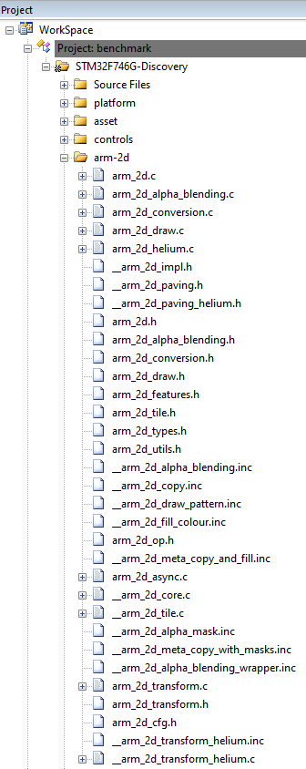
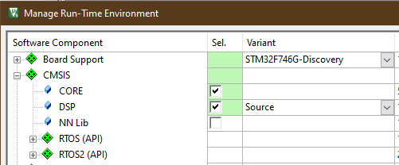

# How to Deploy the Arm-2D Library {#deploy}

This document describes how to deploy the **Arm-2D** library to your existing MDK projects. If you are not familiar with **Arm-2D**, please start from the **[README](../README.md)** first.


## 1 How to Get the Arm-2D

There are three methods to get Arm-2D:

-  Cloning the Arm-2D software repository on Github using the following command line:

  ```shell
  git clone https://github.com/ARM-software/Arm-2D.git
  ```

- Downloading cmsis-packs from the [release page](https://github.com/ARM-software/Arm-2D/releases).

- Checking for Updates in pack-installer and installing the latest Arm-2D packs as shown in **Figure 1-1** and **Figure 1-2**

   **Figure 1-1 Check for Updates in Pack Installer**
    

   
   
   **Figure 1-2 Install the Arm-2D in Pack Installer**
   
    


## 2 How to Deploy Arm-2D Library

### 2.1 Generic Method (Using MDK as an example)

1. Copy the Arm-2D folder to your target project directory.

2. Open the MDK project, add a group in the project viewer and give it a name, for example, `Arm-2D`.

3. Add **ALL** the C source code in the `Library/Source` directory to the Arm-2d group of the project.

4. For ease of use, please add **ALL** header files in the `Library/Include` directory that **have no double-underscores-prefix in their name** to the Arm-2d group of the project.

   **Figure 2-1 A typical project view after Arm-2D Is added**

    


5. Add a search path to MDK project configuration for the Arm-2D header files as shown in **Figure 2-2**:

   **Figure 2-2 Add search path to the project configuration for Arm-2D header files**

    

6. Enable **C11** and **GNU extension** support in C/C++(AC6) configurations:

   **Figure 2-3 Enable "gnu11" in Arm Compiler 6** 

    

7. Arm-2D relies on **CMSIS 5.7.0** and above (If you want to use Arm-2D with Cortex-M55, you need **CMSIS 5.8.0**). Please check the **RTE configuration** and ensure proper CMSIS support has been added to the project (as shown in **Figure 2-4** the **CORE** and **DSP** are required).

   **Figure 2-4 Check the CMSIS support in the RTE configuration window**

    


8. Copy the header file `arm_2d_cfg.h` in `Library\Include\template` to you application folder and set the include search path for this header file. You can find arm-2d configurations in this header file. 


9. Include the header file `arm_2d.h` in your source code where you want to use the library:

```c
   #include "arm_2d.h"
```

10. Initialize Arm-2D by calling function `arm_2d_init()` :

```c
static void system_init(void)
{
    ...
    arm_2d_init();
    ...
}
```


**Figure 2-5 A Typical Configuration for A MDK project**

 

**NOTE:**

1. The option "Short enums/wchar" is **NOT** required by Arm-2D. This option is enabled by default if you create a new MDK project using Arm Compiler 6.


### 2.2 Deploy Using CMSIS-Pack

1. Open the Run-Time Environment configuration dialog using menu "Project->Manage->Run-Time Environment" as shown in **Figure 2-6**.

    **Figure 2-6 Open Run-Time Environment Dialog**
    

2. Expand **Acceleration** and select **Core**, **Alpha-Blending** and **Transform** under **Arm-2D** as shown below. Make sure you also select **CMSIS-CORE** and **CMSIS-DSP**.

    **Figure 2-7 Select Arm-2D in RTE**
     
    
3. Enable **C11** and **GNU extension** support in C/C++(AC6) configurations:
   
    **Figure 2-3 Enable "gnu11" in Arm Compiler 6** 
    
     

4. Include the header file `arm_2d.h` in your source code where you want to use the library:

    ```c
    #include "arm_2d.h"
    ```

5. Initialize Arm-2D by calling function `arm_2d_init()` :

    ```c
    static void system_init(void)
    {
        ...
        arm_2d_init();
       ...
    }
    ```

6. Expand Acceleration in the project view and open `arm_2d_cfg.h` as shown in **Figure 2-8**. 

    **Figure 2-8 Find arm_2d_cfg.h in the project view**
     

    Open the Configuration Wizard, you can see options available for Arm-2D
    
    **Figure 2-9 Configuration Wizard for Arm-2D**
    
     
    
    


## 3 Helper Services and Extras


## 4 Example Projects

**Table 3-1 Summary**


| Projects                           | Description                                                  | Folder                                      | Note                      |
| ---------------------------------- | ------------------------------------------------------------ | ------------------------------------------- | ------------------------- |
| benchmark                          | It is an **ALL-IN-ONE** example that demonstrates almost all features provided by Arm-2D. By setting different PFB sizes, you can evaluate the 2D image processing capability for the target system. | examples/benchmark                          | Can be used as benchmark. |
| watch_panel                        | It is a dedicated example of a smart-watch-like panel. A pointer and two gears rotate at different angular velocities on a translucent watch panel with a dynamic background. | examples/watch_panel                        | Can be used as benchmark  |
| \[template\]\[bare-metal\]\[pfb\]  | It is a project template for the bare-metal environment.     | examples/\[template\]\[bare-metal\]\[pfb\]  | Project Template          |
| \[template\]\[cmsis-rtos2\]\[pfb\] | It is a project template for the RTOS environment, which use CMSIS-RTO2 as an example to show how Arm-2D can work with an RTOS. | examples/\[template\]\[cmsis-rtos2\]\[pfb\] | Project Template          |
