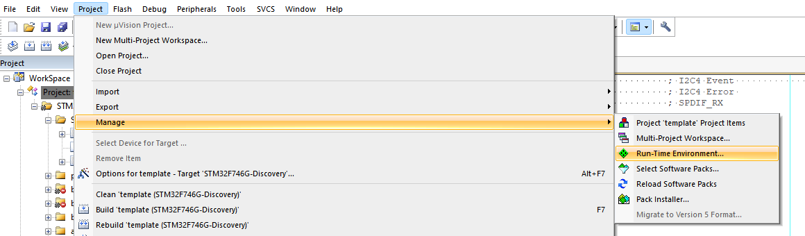

# How to Deploy the Arm-2D Library {#deploy} <!-- omit from toc -->

This document describes how to deploy the **Arm-2D** library to your existing MDK projects. If you are not familiar with **Arm-2D**, please start from the **[README](../README.md)** first.

### Table of Contents
- [1 How to get the Arm-2D](#1-how-to-get-the-arm-2d)
- [2 How to Deploy Arm-2D](#2-how-to-deploy-arm-2d)
  - [2.1 Deploy Using CMSIS-Pack in MDK](#21-deploy-using-cmsis-pack-in-mdk)
- [3 Helper Services and Extras](#3-helper-services-and-extras)
- [4 Example Projects](#4-example-projects)


## 1 How to get the Arm-2D

There are three methods to get Arm-2D:

-  Cloning Arm-2D repository on Github using the following command line:

  ```shell
  git clone https://github.com/ARM-software/Arm-2D.git
  ```

- Downloading Arm-2D CMSIS-Pack from the [release page](https://github.com/ARM-software/Arm-2D/releases).

- Checking for Updates in pack-installer and installing the latest Arm-2D packs as shown in **Figure 1-1** and **Figure 1-2**

   **Figure 1-1 Check for Updates in Pack Installer**
   
    

   
   
   **Figure 1-2 Install Arm-2D in Pack Installer**
   
    


## 2 How to Deploy Arm-2D


### 2.1 Deploy Using CMSIS-Pack in MDK

1. Open the Run-Time Environment configuration dialog using menu "Project->Manage->Run-Time Environment" as shown in **Figure 2-6**.

    **Figure 2-6 Open Run-Time Environment Dialog**
    

2. Expand **Acceleration** and select **Core**, **Alpha-Blending** and **Transform** under **Arm-2D** as shown below. Make sure you also select **CMSIS-CORE** and **CMSIS-DSP**.

    **Figure 2-7 Select Arm-2D in RTE**
     
    
3. Enable **C11** and **GNU extension** support in C/C++(AC6) configurations:
   
    **Figure 2-3 Enable "gnu11" in Arm Compiler 6** 
    
     

4. Include the header file `arm_2d.h` in your source code where you want to use the library:

    ```c
    #include "arm_2d.h"
    ```

5. Initialize Arm-2D by calling function `arm_2d_init()` :

    ```c
    static void system_init(void)
    {
        ...
        arm_2d_init();
       ...
    }
    ```

6. Expand Acceleration in the project view and open `arm_2d_cfg.h` as shown in **Figure 2-8**. 

    **Figure 2-8 Find arm_2d_cfg.h in the project view**
    
      
    
    
    
    Open the **Configuration Wizard** and check options available for Arm-2D
    
    **Figure 2-9 Configuration Wizard for Arm-2D**
    
     
    
    


## 3 Helper Services and Extras


## 4 Example Projects

**Table 3-1 Summary**


| Projects                           | Description                                                  | Folder                                      | Note                      |
| ---------------------------------- | ------------------------------------------------------------ | ------------------------------------------- | ------------------------- |
| benchmark                          | It is an **ALL-IN-ONE** example that demonstrates almost all features provided by Arm-2D. By setting different PFB sizes, you can evaluate the 2D image processing capability for the target system. | examples/benchmark                          | Can be used as benchmark. |
| watch_panel                        | It is a dedicated example of a smart-watch-like panel. A pointer and two gears rotate at different angular velocities on a translucent watch panel with a dynamic background. | examples/watch_panel                        | Can be used as benchmark  |
| \[template\]\[bare-metal\]\[pfb\]  | It is a project template for the bare-metal environment.     | examples/\[template\]\[bare-metal\]\[pfb\]  | Project Template          |
| \[template\]\[cmsis-rtos2\]\[pfb\] | It is a project template for the RTOS environment, which use CMSIS-RTO2 as an example to show how Arm-2D can work with an RTOS. | examples/\[template\]\[cmsis-rtos2\]\[pfb\] | Project Template          |
