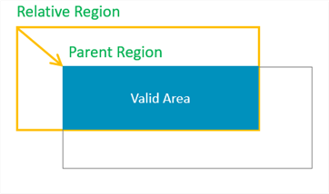
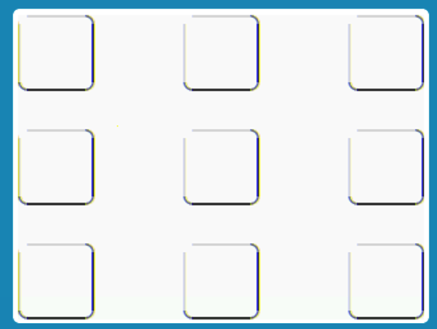

# How to Use Layout Assistant

When we use arm-2d for 2D image processing, almost all APIs need to specify the target Region. Especially for those users who need to use Arm-2D for simple UI design, how to place graphic elements and how to deal with the layout of the screen is essentially a problem of Region calculation. In order to free users from manual Region calculations, Arm-2D refers to the popular GUI layout methodology and provides a series of simple and easy-to-use Helpers in the form of macro templates, called Layout Assistant.

This article will introduce the use of Arm-2D Layout Assistant in detail through examples.


## 1 Basic Concepts

We assume that you are getting into Arm-2D for the first time, so in order for you to understand the following content, we need to introduce some basic concepts first, such as Region, canvas, container and so on.

### 1.1 Region

Region is a rectangular area described by the Location (the coordinates of the upper left corner) and the Size information.

```c
typedef struct arm_2d_region_t {
    implement_ex(arm_2d_location_t, tLocation);
    implement_ex(arm_2d_size_t, tSize);
} arm_2d_region_t;
```

**Figure 1-1 Region with Location and Size ** 

 

#### 1.1.1 Location

The coordinate of the Region is defined by the vertices at the upper left corner of the bit rectangle. Its data structure is as follows:

```c
typedef struct arm_2d_location_t {
    int16_t iX;
    int16_t iY;
} arm_2d_location_t;
```

Different from the general Cartesian coordinate system, in graphics, the Y-axis is usually mirrored in the opposite direction, which means that the lower the Y coordinate is, the larger the Y coordinate is. In the Boxing model that will be introduced later, we will understand that the **coordinates of a Region can be negative**, representing the position of the current Region relative to the starting point of its parent Region.

**Figure 1-2 When Location has a negative coordinates.** 

 

As shown in **Figure 1-2**, when the ***x*** and ***y*** coordinates of a Region are both negative, it actually has a considerable area outside (upper left corner) of its parent Region. When we try to find the intersection of the current Region and its parent Region, we will find that only part of the region is valid.

#### 1.1.2 Size

The size information of the Region is described by the Height and Width together. The data structure is defined as follows:

```c
typedef struct arm_2d_size_t {
    int16_t iWidth;
    int16_t iHeight;
} arm_2d_size_t;
```

Although a signed type ***int16_t*** is used to describe the width and height, negative numbers are meaningless and should be avoided.

### 1.2 Boxing Model

The so-called Boxing Model describes the affiliation between Regions, which is often used to describe the relationship between containers and visual elements. 

In a GUI stack, the Boxing Model usually talks about more complex stuff, such as the border's width, the margin inside a container border, the padding of / distance between the elements inside a container etc. Arm-2D does ***NOT*** cares about these details but only describes the simple relationship between a container and the elements inside.

#### 1.2.1 Absolute Location and Relative Location

In Arm-2d, we consider panels or windows as containers, and the Locations of the panels and the windows are their coordinates in the display buffer. **We call this kind of location information that directly describes the coordinates in a display buffer as an Absolute Location**. In **Figure 1-3**, the panel (top container) coordinates are absolute coordinates.

The coordinates of the elements inside a container are described as **coordinates relative to the upper left corner of the parent container**. We call this kind of Locations the **Relative Locations**. In addition to that, since the container is only a special element, container nesting becomes possible.  In **Figure 1-3**, the two innermost Regions have Relative Locations.

**Figure 1-3 A Typical Example of Absolute Locations and Relative Locations**

 

#### 1.2.2 Absolute Region and Relative Region

If a Region has absolute Location, it is an **Absolute Region**; similarly, if a  Region has relative Location, it is a **Relative Region**.

**Figure 1-4 A Typical Example of Absolute Regions and Relative Regions**

 

When we use these relative and absolute information to perform visual area calculations, it is easy to exclude those areas that are actually invisible to the user from various graphic operations, thereby improving the overall 2D processing performance (as shown in **Figure 1-4** ).

### 1.2 Canvas

The essence of the canvas is Region. To draw on a Tile, we need to use `arm_2d_canvas()` to create a canvas first. The syntax is as follows:

```c
arm_2d_canvas(<The address of the target tile>, <the canvas name>) {
    /* the scope of the canvas */
}
```

Here `arm_2d_canvas()` takes two parameters, i.e. the **address of the target Tile** and the **name of the canvas**. `arm_2d_canvas()` will create a canvas with the specified name for the specified Tile. 

**NOTE**: Canvas cannot be used outside of curly braces.

For example:

```c
static
IMPL_PFB_ON_DRAW(__pfb_draw_scene0_handler)
{
    ARM_2D_UNUSED(ptTile); /* the target screen */
    ...
    arm_2d_canvas(ptTile, __top_canvas) {
        /* place your drawing code here */
    }

    arm_2d_op_wait_async(NULL);
    return arm_fsm_rt_cpl;
}
```

This is a typical scene drawing function, where `ptTile` points to the target Tile representing the screen. In order to draw on the screen, we need to create a canvas for it, namely `__top_canvas` in the example.

### 1.3 Container

Region is just a descriptive information. How to interpret the meaning of Region depends entirely on which API we use. Similarly, when we use the canvas for layout, it often happens that the actual graphic elements exceed the scope of the canvas. At this point, whether to clip the excess part depends on the specific situation. But if we clearly want the part beyond the canvas to be clipped, then we need to introduce the concept of Container.

The essence of the container is a Child-Tile, and any content that exceeds the rectangular area of the child tile will be clipped. Via the macro `arm_2d_container()` we can easily create a container. The syntax is as follows:

```c
arm_2d_container(<the address of the target tile>, <the name of the new child tile>, <the address of the target region>)
```

Here `arm_2d_container()` takes three parameters, i.e. the **address of the target Tile**, the **name of the new Child Tile**, and **the address of the target region**. `arm_2d_container()` will generate a new child tile with the name specified by the user according to the given target Region, and generate the corresponding canvas with `__canvas` as the suffix. For example, if we specify the name of the child tile as `my_container`, then the corresponding canvas is called `my_container_canvas`. 

**NOTE**:  

1. The address of the target Region can be `NULL`. In this case, the child tile essentially coincides with the target Tile in size.
2. The child tile and the canvas cannot be used outside of curly braces.

```c
RM_NONNULL(1)
void control_template_show( user_control_template_t *ptThis,
                            const arm_2d_tile_t *ptTile, 
                            const arm_2d_region_t *ptRegion, 
                            bool bIsNewFrame)
{
    ...

    arm_2d_container(ptTile, __control, ptRegion) {
        /* put your drawing code inside here
         *    - &__control is the target tile (please do not use ptTile anymore)
         *    - __control_canvas is the canvas
         */

    }

    arm_2d_op_wait_async(NULL);
}

```

The above example comes from the control template. In general GUI design, the part beyond the rectangular area of the control needs to be clipped, that's why we create a container for a user control. 


## 2 Alignment

In UI design, alignment is the most basic layout method. There are 9 alignments as shown in **Figure 2-1**:

**Figure 2-1 The 9 alignments**

 


Arm-2D provides macros with a unified style for these 9 alignments, as shown in **Table 2-1**:

**Table 2-1 Macros and Regions for the 9 alignments**

|            | Left                                                 | Central                                                  | Right                                                  |
| ---------- | ---------------------------------------------------- | -------------------------------------------------------- | ------------------------------------------------------ |
| **Top**    | `arm_2d_align_top_left()`: `__top_left_region`       | `arm_2d_align_top_centre()`: `__top_centre_region`       | `arm_2d_align_top_right()`: `__top_right_region`       |
| **Middle** | `arm_2d_align_mid_left()`: `__mid_left_region`       | `arm_2d_align_centre()`: `__centre_region`               | `arm_2d_align_mid_right()`: `__mid_right_region`       |
| **Bottom** | `arm_2d_align_bottom_left()`: `__bottom_left_region` | `arm_2d_align_bottom_centre()`: `__bottom_centre_region` | `arm_2d_align_bottom_right()`: `__bottom_right_region` |


The syntax of these macros is as follows:

**Syntax 1:** 

```c
arm_2d_align_<alignment>(<the target region: arm_2d_region_t>, <the width of the target area: int16_t>, <the height of the target area: int16_t>) {
    /* You can use a region called __<alignment>_region in the scope defined by the curly braces*/
    ...
}
```

Here the macro helper `arm_2d_align_<alignment>` takes three arguments, i.e. the **target region object**, the **width** and **height** of the target area. 

**NOTE**: Please pass the **arm_2d_region_t object** to the macro helper as the target region but **NOT** the **address of the arm_2d_region_t object**.

**Syntax 2:**

```c
arm_2d_align_<alignment>(<the target region: arm_2d_region_t>, <the size of the target area: arm_2d_size_t>) {
    /* You can use a region called __<alignment>_region in the scope defined by the curly braces*/
    ...
}
```

Here the macro helper `arm_2d_align_<alignment>` takes two arguments, i.e. the **target region object** and the **size of the target area**. 

**NOTE**: 

1. Please pass the **arm_2d_region_t object** to the macro helper as the target region but **NOT** the **address of the arm_2d_region_t object**. 
2. Please pass the **arm_2d_size_t object** to the macro helper as the size of the target area but **NOT** the **address of the arm_2d_size_t object**. 


Based on the syntax above, the code corresponding to **Figure 2-1** is as follows:

```c
static
IMPL_PFB_ON_DRAW(__pfb_draw_scene0_handler)
{
    user_scene_0_t *ptThis = (user_scene_0_t *)pTarget;
    ARM_2D_UNUSED(ptTile);
    ARM_2D_UNUSED(bIsNewFrame);
    
    arm_2d_canvas(ptTile, __top_canvas) {
    /*-----------------------draw the foreground begin-----------------------*/
        
        /* following code is just a demo, you can remove them */
        
        arm_2d_fill_colour(ptTile, NULL, GLCD_COLOR_WHITE);


        
        arm_2d_align_top_left(__top_canvas, 60, 60 ) {
            
            draw_round_corner_border(   ptTile, 
                                        &__top_left_region, 
                                        GLCD_COLOR_BLACK, 
                                        (arm_2d_border_opacity_t)
                                            {32, 32, 255-64, 255-64},
                                        (arm_2d_corner_opacity_t)
                                            {0, 128, 128, 128});
                                    
        }
        arm_2d_align_top_centre(__top_canvas, 60, 60 ) {
            
            draw_round_corner_border(   ptTile, 
                                        &__top_centre_region, 
                                        GLCD_COLOR_BLACK, 
                                        (arm_2d_border_opacity_t)
                                            {32, 32, 255-64, 255-64},
                                        (arm_2d_corner_opacity_t)
                                            {0, 128, 128, 128});
                                    
        }
        arm_2d_align_top_right(__top_canvas, 60, 60 ) {
            
            draw_round_corner_border(   ptTile, 
                                        &__top_right_region, 
                                        GLCD_COLOR_BLACK, 
                                        (arm_2d_border_opacity_t)
                                            {32, 32, 255-64, 255-64},
                                        (arm_2d_corner_opacity_t)
                                            {0, 128, 128, 128});
                                    
        }

        arm_2d_align_bottom_left(__top_canvas, 60, 60 ) {
            
            draw_round_corner_border(   ptTile, 
                                        &__bottom_left_region, 
                                        GLCD_COLOR_BLACK, 
                                        (arm_2d_border_opacity_t)
                                            {32, 32, 255-64, 255-64},
                                        (arm_2d_corner_opacity_t)
                                            {0, 128, 128, 128});
                                    
        }
        
        arm_2d_align_mid_left(__top_canvas, 60, 60 ) {
            
            draw_round_corner_border(   ptTile, 
                                        &__mid_left_region, 
                                        GLCD_COLOR_BLACK, 
                                        (arm_2d_border_opacity_t)
                                            {32, 32, 255-64, 255-64},
                                        (arm_2d_corner_opacity_t)
                                            {0, 128, 128, 128});
                                    
        }
        arm_2d_align_centre(__top_canvas, 60, 60 ) {
            
            draw_round_corner_border(   ptTile, 
                                        &__centre_region, 
                                        GLCD_COLOR_BLACK, 
                                        (arm_2d_border_opacity_t)
                                            {32, 32, 255-64, 255-64},
                                        (arm_2d_corner_opacity_t)
                                            {0, 128, 128, 128});
                                    
        }
        arm_2d_align_mid_right(__top_canvas, 60, 60 ) {
            
            draw_round_corner_border(   ptTile, 
                                        &__mid_right_region, 
                                        GLCD_COLOR_BLACK, 
                                        (arm_2d_border_opacity_t)
                                            {32, 32, 255-64, 255-64},
                                        (arm_2d_corner_opacity_t)
                                            {0, 128, 128, 128});
                                    
        }
        
        
        arm_2d_align_bottom_centre(__top_canvas, 60, 60 ) {
            
            draw_round_corner_border(   ptTile, 
                                        &__bottom_centre_region, 
                                        GLCD_COLOR_BLACK, 
                                        (arm_2d_border_opacity_t)
                                            {32, 32, 255-64, 255-64},
                                        (arm_2d_corner_opacity_t)
                                            {0, 128, 128, 128});
                                    
        }
        arm_2d_align_bottom_right(__top_canvas, 60, 60 ) {
            
            draw_round_corner_border(   ptTile, 
                                        &__bottom_right_region, 
                                        GLCD_COLOR_BLACK, 
                                        (arm_2d_border_opacity_t)
                                            {32, 32, 255-64, 255-64},
                                        (arm_2d_corner_opacity_t)
                                            {0, 128, 128, 128});
                                    
        }

        /* draw text at the top-left corner */

//        arm_lcd_text_set_target_framebuffer((arm_2d_tile_t *)ptTile);
//        arm_lcd_text_set_font(&ARM_2D_FONT_6x8.use_as__arm_2d_font_t);
//        arm_lcd_text_set_draw_region(NULL);
//        arm_lcd_text_set_colour(GLCD_COLOR_RED, GLCD_COLOR_WHITE);
//        arm_lcd_text_location(0,0);
//        arm_lcd_puts("Scene 0");

    /*-----------------------draw the foreground end  -----------------------*/
    }
    arm_2d_op_wait_async(NULL);

    return arm_fsm_rt_cpl;
}
```


## 3 Layout

### 3.1 Line Stream Layout

### 3.2 Stream Layout


