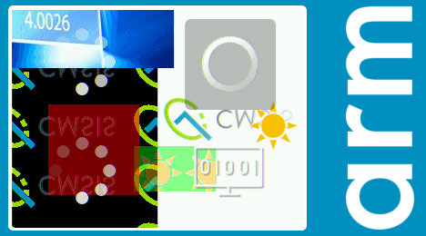
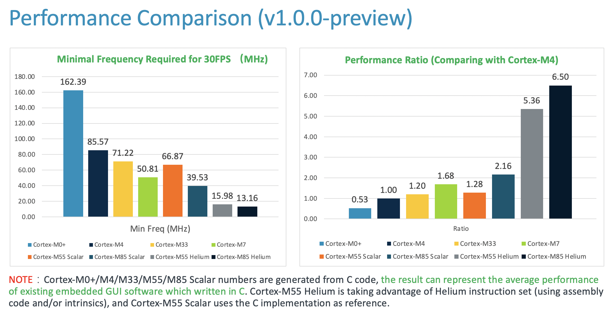
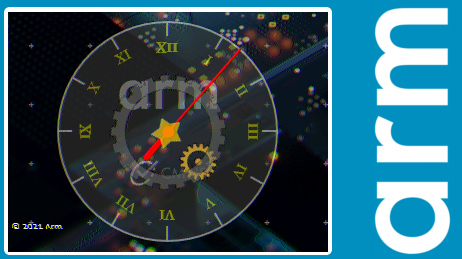

# README

## 1. Default Examples 

### 1.1 Benchmark

**PROJECT:    benchmark**

It is an **ALL-IN-ONE** example that demonstrates almost all the features provided by the library. It is also used as a benchmark of Arm-2D. Since there is no public benchmark available for micro-controllers, we decide to overcome this problem with the following methods and considerations:

- **Choose the widely used algorithms in embedded GUI as the body of the benchmark**
  - Alpha-blending
  - Colour-Keying
  - Image Copy
  - Texture Paving
  - Rotation
  - Mirroring
  - Masking
- **Simulate a typical application scenario with sufficient complexity**
  - Background with Texture paving (switching different mirroring modes every 4 second)
  - Foreground picture 
  - Two constructed layers for alpha-blending and texture paving
  - Moving icons
  - Spinning busy wheel
- **Choose a typical low-cost LCD resolution 320*240 in RGB565**
- **Let those layers float with different angles and speed to cover a sufficient number of conditions.**
- **Record the cycle count used for blending one frame and run 1000 iterations (frames).** 

**Figure 1-1 A snapshot of benchmark running on Cortex-M4 FVP platform**

 

- **Use the average cycle count in 1000 iterations as benchmark score.**

  - Based on that, for typical embedded application requirement, we derive a more meaningful metrics called the **Minimal Frequency Required for 30 FPS (MHz)** as shown in **Figure 1-5**. 

  

**Figure 1-2 Performance Comparison among some Cortex-M processors**

  

### 1.2 Watch-Panel

**PROJECT:    watch_panel**

It is an example of rotation APIs. It consists of five layers:

1. A floating background layer (Using Tile Copy)
2. A clock_panel layer (Using Alpha Blending With Colour Keying)
3. A small gold gear (Rotation)
4. A big black gear (Rotation with Opacity)
5. A red pointer (Rotation)
6. A golden star (Rotation, scaling with Opacity)

This demo also shows how a fancy looking clock could be rendered with just less than 10K RAM (or even less by using a smaller PFB size). 

**Figure 1-3  A snapshot of watch-panel running on Cortex-M4 FVP platform**

 