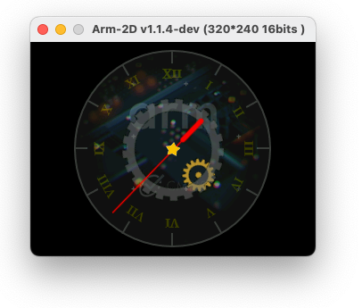

# How to build Arm-2D Application Demos with CMSIS build tools


## 1 Overview

Details about the 2 demos:
(https://github.com/ARM-software/Arm-2D/tree/main/examples)


- **Generic Benchmark**:
  - Background with Texture paving (switching different mirroring modes every 4 second)
  - Foreground picture
  - Two constructed layers for alpha-blending and texture paving
  - Moving icons
  - Spinning busy wheel


- **watch_panel**
  - A floating background layer (Using Tile Copy)
  - A clock_panel layer (Using Alpha Blending with Colour Keying)
  - A small gold gear (Rotation)
  - A big black gear (Rotation with Opacity)
  - A red pointer (Rotation)
  - A golden star (Rotation, scaling with Opacity)




## 2 Install CMSIS Build tools 

see : https://github.com/Open-CMSIS-Pack/cmsis-toolbox/blob/main/docs/installation.md

For now, please use version **1.1.0**


### 2.1 For Linux


```
wget https://github.com/Open-CMSIS-Pack/cmsis-toolbox/releases/download/1.1.0/cmsis-toolbox-linux64.tar.gz
```

Decompress it in your workspace and setup environment variables as described in the link above

```
tar -zxvf cmsis-toolbox-linux64.tar.gz
PATH=$PATH:<your_cmsis_tool_path>/cmsis-toolbox-linux64/bin/
export CMSIS_COMPILER_ROOT=<your_cmsis_tool_path>/cmsis-toolbox-linux64/etc/
export CMSIS_PACK_ROOT=<your_cmsis_pack_storage_path>cmsis-pack
```

In case not already done, load and setup **Arm Compiler 6.18** or later

Then report the tool path in : `<your_cmsis_tool_path>/cmsis-toolbox-linux64/etc/AC6.6.18.0.cmake`

```makefile
 ############### EDIT BELOW ###############
# Set base directory of toolchain
set(TOOLCHAIN_ROOT "<arm_compiler_6_path>/bin/")
set(EXT)

############ DO NOT EDIT BELOW ###########
```

Initialize the new pack repository

```
cpackget init https://www.keil.com/pack/index.pidx
```


### 2.2 For Windows

To be completed...


## 3 Build the project

### 3.1 Generate list of needed packs

From this `Arm-2D_Demos` folder, type the command:

```
csolution list packs -s arm2d.csolution_ac6.yml -m > required_packs.txt
```

Remove the `GorgonMeducer::perf_counter@1.9.11` packs from this list.

The perf_counter pack has to be downloaded from GitHub and installed separately.


### 3.2 Install the packs

```
cpackget add -f required_packs.txt
```

As mentioned above, **perf_counter won't be found since it's hosted on GitHub**.
Download **perf_counter pack 1.9.11** from GitHub and install it:

```
cpackget add https://github.com/GorgonMeducer/perf_counter/raw/main/cmsis-pack/GorgonMeducer.perf_counter.1.9.11.pack
```


### 3.3 Convert csolution

```
csolution convert -s arm2d.csolution_ac6.yml
```

It will generate several project files:

* For each project (here there are 2, one for the Generic Bench and one for the Watchpanel demo)
* For each target : CS300, CS310 ...

Expected output:

```shell
arm2d_generic.Release+MPS3-Corstone-300.cprj - info csolution: file generated successfully
arm2d_generic.Release+VHT-Corstone-300.cprj - info csolution: file generated successfully
arm2d_generic.Release+VHT-Corstone-310.cprj - info csolution: file generated successfully

arm2d_smartwatch.Release+MPS3-Corstone-300.cprj - info csolution: file generated successfully
arm2d_smartwatch.Release+VHT-Corstone-300.cprj - info csolution: file generated successfully
arm2d_smartwatch.Release+VHT-Corstone-310.cprj - info csolution: file generated successfully
```

### 3.4 Build the cprj file

To build the projects:

 - Generic bench

To be completed


 - Watch panel bench

To be completed


## 4 Run the applications

To be completed...

It should take a few minutes and display at the end:

```
To be completed...

```


## 5 Customizations:

- Applications are currently running **3** iterations, but this can be customized in the **arm2d.csolution_ac6.yml** file

  This generates respectively approx **2.7M** and **4M** instructions for the smartwatch and generic applications.


```yaml
      misc:
        - C:
           - -DITERATION_CNT=3
           - -D__ARM_2D_CFG_BENCHMARK_EXIT_WHEN_FINISH__
        - CPP:
           - -DITERATION_CNT=3
           - -D__ARM_2D_CFG_BENCHMARK_EXIT_WHEN_FINISH__

```


## 6 Appendix

### 6.1 Files

* **arm2d.csolution_ac6.yml**
  * Solution files describing all the solutions and the common settings
* **arm2d_smartwtach.cproject.yml** and **arm2d_generic.cproject.yml**
  * The project describing the source files, components and layers
* **boot.clayer.yml**
  * Boot code for SC300, SC310 or normal M4, M7 etc ...